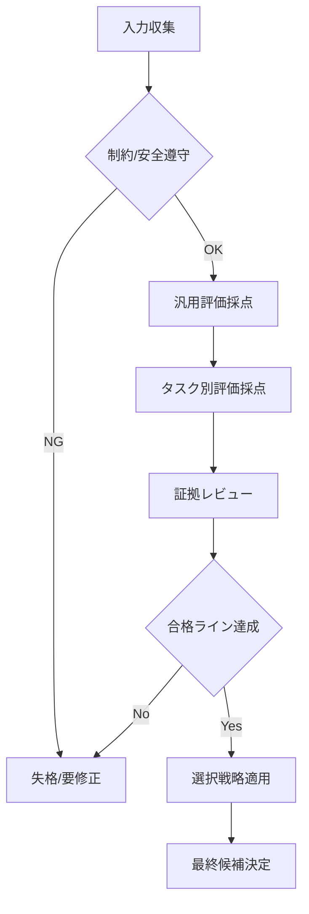

# codex exec サブエージェント評価基準カタログ

## 1. スコア定義（共通尺度）
| スコア | 定義 | 具体的な判定例 |
|---:|---|---|
| 5 | 期待を完全に満たす | 要件逸脱なし、再実行不要、証拠が揃う |
| 4 | ほぼ満たす | 軽微な修正で完了、重要要件は全て達成 |
| 3 | 一部不足 | 主要要件は達成、補完が必要 |
| 2 | 不十分 | 要件の中核に欠落、手戻りが多い |
| 1 | 失敗 | 要件未達、証拠不在、重大な誤り |

## 2. 汎用評価基準（重み付き）
| 基準 | 重み(%) | 評価観点 | 証拠 | 実用例 |
|---|---:|---|---|---|
| CORRECTNESS | 40 | 要件・仕様の正確な満足、誤りの有無 | テスト結果、実行ログ、要件対応表 | 出力コードがテストに合格している |
| COMPLETENESS | 25 | 指示の網羅、必要成果物の欠落なし | 差分、成果物一覧、未完タスク有無 | 指定ファイルが全て更新されている |
| QUALITY | 20 | 可読性、保守性、一貫性、設計妥当性 | コード規約、構成、レビュー指摘 | 設計が冗長でなく責務が明確 |
| EFFICIENCY | 15 | 無駄な変更や試行の最小化 | コマンド履歴、差分量、回数 | 不要な大規模リファクタを避ける |

## 3. タスク別評価基準（重み付き）

### 3.1 コード生成
| 基準 | 重み(%) | 評価観点 | 証拠 | 実用例 |
|---|---:|---|---|---|
| 仕様一致 | 35 | 入力/出力、境界条件、エラー処理 | テスト、使用例 | 例外条件が仕様どおり |
| 実装整合 | 25 | 既存構造との整合、影響範囲 | 依存関係、差分 | 既存APIを壊さない |
| テスト妥当 | 20 | 実行結果、検証の再現性 | テストログ | 追加/更新テストが通る |
| 変更最小化 | 20 | 必要最小の差分、無駄排除 | 差分量、ファイル数 | 不要ファイル追加なし |

### 3.2 コードレビュー
| 基準 | 重み(%) | 評価観点 | 証拠 | 実用例 |
|---|---:|---|---|---|
| 重大欠陥検出 | 40 | バグ・セキュリティ・回帰の指摘 | 指摘一覧、根拠 | 競合状態の指摘と再現条件 |
| 正確性 | 25 | 指摘が事実と一致 | 根拠行、実行結果 | 行番号と挙動が一致 |
| 網羅性 | 20 | 重要箇所のカバー率 | 変更範囲レビュー | 主要変更点を全て確認 |
| 優先順位付け | 15 | 影響度に応じた整理 | 指摘の分類 | 重大→中→軽微の順で提示 |

### 3.3 分析・調査
| 基準 | 重み(%) | 評価観点 | 証拠 | 実用例 |
|---|---:|---|---|---|
| 事実性 | 35 | 根拠明示、推測排除 | ログ、参照先 | 実測ログに基づく原因特定 |
| 再現性 | 25 | 手順と結果の再現可能性 | 再現手順、環境 | 誰でも同手順で再現可能 |
| 洞察の有用性 | 20 | 次アクションに直結 | 判断材料、選択肢 | 影響範囲と対策案を明示 |
| 情報整理 | 20 | 重要度順の整理、過不足 | 要約、比較表 | 要点が1枚で理解可能 |

### 3.4 ドキュメント生成
| 基準 | 重み(%) | 評価観点 | 証拠 | 実用例 |
|---|---:|---|---|---|
| 正確性 | 30 | 内容が実装/仕様と一致 | 参照リンク、差分 | API仕様と記載が一致 |
| 網羅性 | 25 | 想定読者の必要情報網羅 | セクション構成 | セットアップ手順が欠落なし |
| 可読性 | 25 | 構造・見出し・例の品質 | 見出し、表、例 | 例が実行可能で明確 |
| 維持容易性 | 20 | 更新しやすい構成 | 参照関係 | 変更点だけ更新で済む |

## 4. 選択戦略カタログ
| 戦略 | 目的 | 適用条件 | 決定ルール | 実用例 |
|---|---|---|---|---|
| BEST_SINGLE | 最高品質を最優先 | 明確な高得点候補が存在 | 総合スコア最大を採用 | 1候補が4.6、他が4.0以下 |
| VOTING | 複数評価の合意重視 | 評価者/基準が複数 | 多数決 or 平均スコア上位 | 3評価者の平均で上位を選択 |
| HYBRID | 重大基準を必須化 | 正確性が最重要 | CORRECTNESS閾値＋総合上位 | CORRECTNESS>=4かつ総合上位 |
| CONSERVATIVE | 失敗リスク最小化 | 影響が大きい変更 | 最小変更量かつ合格ライン | 変更範囲が最小の合格案 |

## 5. 評価プロセス（チェックポイント）
| ステップ | 目的 | 入力 | 出力 | 実用例 |
|---|---|---|---|---|
| 1. 収集 | 事実ベース確認 | 実行ログ、差分、指示 | 評価対象パッケージ | コマンド結果とPR差分 |
| 2. 遵守確認 | 制約・安全確認 | ルール、要件 | 失格/継続判定 | 機密露出があれば失格 |
| 3. 汎用採点 | 品質の基本評価 | 汎用基準 | 汎用スコア | CORRECTNESS=4 |
| 4. タスク別採点 | 文脈適合評価 | タスク別基準 | タスク別スコア | ドキュメント可読性=5 |
| 5. 総合判定 | 採否判断 | 重み合算 | 合格/要修正 | 合格ライン3.8以上 |
| 6. 選択戦略 | 候補決定 | 戦略カタログ | 最終候補 | HYBRID採用 |

## 6. 総合スコア計算（実用例）
| 項目 | 値 | 備考 |
|---|---|---|
| 汎用スコア | 4.2 | CORRECTNESS 4.5, COMPLETENESS 4.0, QUALITY 4.0, EFFICIENCY 3.5 |
| タスク別スコア | 4.0 | コード生成基準 |
| 合成比率 | 60%/40% | 汎用/タスク別 |
| 総合スコア | 4.12 | 4.2×0.6 + 4.0×0.4 |

## 7. 評価プロセスのフローチャート

## 8. 選択戦略の実用例（候補比較）
| 候補 | 汎用スコア | タスク別スコア | 総合スコア | 備考 |
|---|---:|---:|---:|---|
| A | 4.6 | 4.2 | 4.44 | CORRECTNESS 5 |
| B | 4.3 | 4.5 | 4.38 | EFFICIENCY 5 |
| C | 4.1 | 4.0 | 4.06 | 変更量少 |

| 戦略 | 採用候補 | 理由 |
|---|---|---|
| BEST_SINGLE | A | 総合スコア最大 |
| VOTING | A | 平均評価でも上位 |
| HYBRID | A | CORRECTNESS閾値満たす |
| CONSERVATIVE | C | 変更量最小で合格ライン達成 |

---

*Generated by codex exec (Meta-Phase 2) on 2025-12-22*
