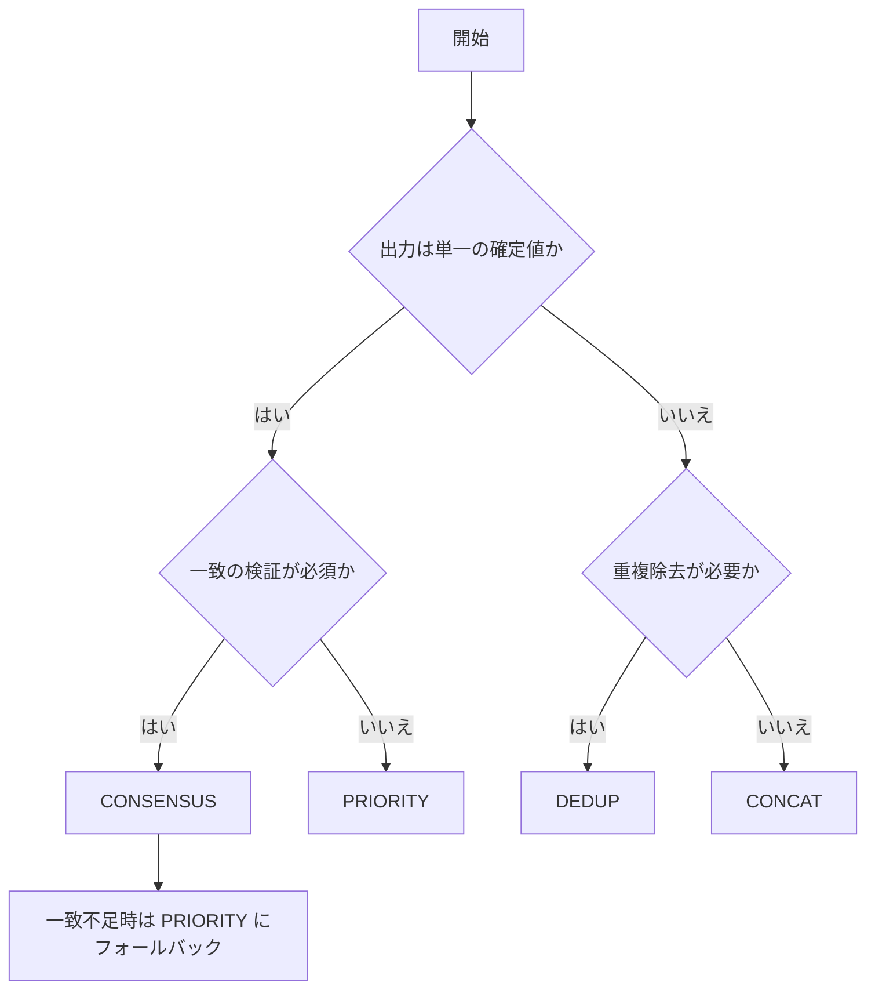

# codex exec サブエージェント結果のマージ戦略ガイド

## 目的
複数の codex exec サブエージェント出力を、用途に応じて一貫性のある形で統合する。

## 前提: 入力の正規化
- 出力は一度 `items` に変換してからマージする（例: `key/value` の構造）。
- すべての `items` に `agent_id`, `confidence`, `priority` を付与する。
- 文字列比較は正規化（小文字化、空白圧縮、句読点除去）を行う。

## 判断フロー（戦略選択）


## マージ戦略
### CONCAT
- 目的: すべての候補を保持し、情報量を最大化する。
- 適用: ブレスト、可能性の列挙、調査ログの束ね。
- 注意: 競合は未解決のまま残るため、後段の選別が必要。

### DEDUP
- 目的: 重複を除去し、ユニークな候補のみ残す。
- 適用: 要件一覧、チェックリスト、TODO 集約。
- 注意: 近似重複を正規化ルールで統一する。

### PRIORITY
- 目的: 優先度や信頼度が高いエージェントの出力を採用する。
- 適用: 権威付けされたサブエージェントが存在する場合。
- 注意: 優先度の根拠は明示する。

### CONSENSUS
- 目的: 複数エージェントが一致する内容のみ採用する。
- 適用: 単一解が必要で、合意が品質基準となる場合。
- 注意: 一致不足時のフォールバック戦略が必須。

## 競合解決アルゴリズム
1. 正規化: すべての `item.value` を同一ルールで正規化。
2. グルーピング: `item.key` ごとに候補を集約。
3. 一致判定: 同一 `key` 内で `value` が完全一致なら単一化。
4. 競合判定: 異なる `value` が存在する場合は以下を適用。
5. 解決方針:
   - CONSENSUS: 投票数と比率で採用候補を決定。
   - PRIORITY: スコアに基づき単一選択。
   - DEDUP: `value` ごとに最上位候補を採用。
6. タイブレーク: `priority` → `confidence` → `agent_id` の順に固定。

スコア例:
```
score = priority_weight * priority + confidence_weight * confidence
```

## タスク種別ごとの推奨戦略
| タスク種別 | 推奨戦略 | 理由/補足 |
| --- | --- | --- |
| ブレスト/候補列挙 | CONCAT | 情報量を維持し、後段で選別 |
| 要件/チェックリスト | DEDUP | 重複除去が主目的 |
| 単一解の決定 | CONSENSUS + PRIORITY | 合意が品質基準、合意不足時は優先 |
| 権威エージェント基準の判断 | PRIORITY | 決定権の明確化 |
| リスク評価/検証 | CONSENSUS | 複数視点の一致が必要 |

## Python 実装のインターフェース例
```python
from __future__ import annotations

from dataclasses import dataclass
from enum import Enum
from typing import Iterable, List, Dict
from collections import Counter, defaultdict
import re

class Strategy(str, Enum):
    CONCAT = "concat"
    DEDUP = "dedup"
    PRIORITY = "priority"
    CONSENSUS = "consensus"

@dataclass(frozen=True)
class Item:
    key: str
    value: str
    agent_id: str
    confidence: float
    priority: int

@dataclass(frozen=True)
class AgentResult:
    agent_id: str
    items: List[Item]

@dataclass(frozen=True)
class MergeConfig:
    min_votes: int = 2
    min_ratio: float = 0.6
    priority_weight: float = 1.0
    confidence_weight: float = 1.0

def _normalize(text: str) -> str:
    text = text.strip().lower()
    text = re.sub(r"\s+", " ", text)
    text = re.sub(r"[^\w\s-]", "", text)
    return text

def _score(item: Item, cfg: MergeConfig) -> float:
    return cfg.priority_weight * item.priority + cfg.confidence_weight * item.confidence

def _resolve_conflict(candidates: List[Item], cfg: MergeConfig) -> Item:
    return max(
        candidates,
        key=lambda i: (_score(i, cfg), i.agent_id),
    )

def _group_by_key(items: Iterable[Item]) -> Dict[str, List[Item]]:
    groups: Dict[str, List[Item]] = defaultdict(list)
    for item in items:
        groups[item.key].append(item)
    return groups

def _dedup_values(candidates: List[Item], cfg: MergeConfig) -> List[Item]:
    buckets: Dict[str, List[Item]] = defaultdict(list)
    for item in candidates:
        buckets[_normalize(item.value)].append(item)
    return [_resolve_conflict(group, cfg) for group in buckets.values()]

def _consensus_pick(candidates: List[Item], cfg: MergeConfig) -> Item:
    normalized = [_normalize(i.value) for i in candidates]
    counts = Counter(normalized)
    top_value, top_votes = counts.most_common(1)[0]
    ratio = top_votes / len(candidates)
    if top_votes >= cfg.min_votes and ratio >= cfg.min_ratio:
        winners = [i for i in candidates if _normalize(i.value) == top_value]
        return _resolve_conflict(winners, cfg)
    return _resolve_conflict(candidates, cfg)

def merge_results(
    results: List[AgentResult],
    strategy: Strategy,
    cfg: MergeConfig = MergeConfig(),
) -> List[Item]:
    items = [item for r in results for item in r.items]

    if strategy == Strategy.CONCAT:
        return sorted(items, key=lambda i: (-i.priority, -i.confidence, i.agent_id))

    merged: List[Item] = []
    for key, group in _group_by_key(items).items():
        if strategy == Strategy.DEDUP:
            merged.extend(_dedup_values(group, cfg))
        elif strategy == Strategy.PRIORITY:
            merged.append(_resolve_conflict(group, cfg))
        elif strategy == Strategy.CONSENSUS:
            merged.append(_consensus_pick(group, cfg))
        else:
            raise ValueError(f"Unknown strategy: {strategy}")

    return merged

# 使用例
if __name__ == "__main__":
    r1 = AgentResult(
        agent_id="a1",
        items=[Item("db", "postgres", "a1", 0.9, 2), Item("cache", "redis", "a1", 0.8, 2)],
    )
    r2 = AgentResult(
        agent_id="a2",
        items=[Item("db", "postgresql", "a2", 0.7, 1), Item("cache", "redis", "a2", 0.9, 1)],
    )

    merged = merge_results([r1, r2], Strategy.CONSENSUS)
    for item in merged:
        print(item.key, item.value)
```

---

*Generated by codex exec (Meta-Phase 2) on 2025-12-22*
