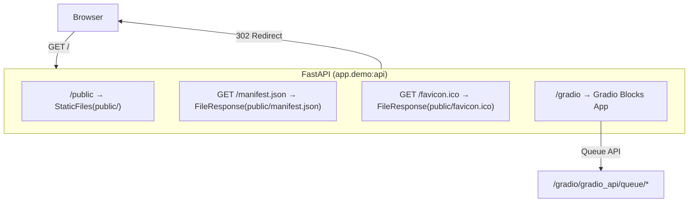
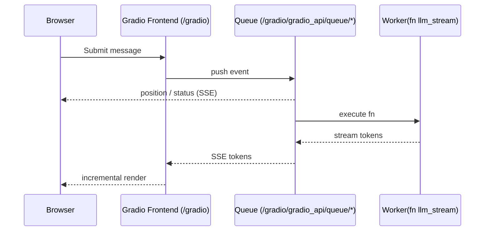
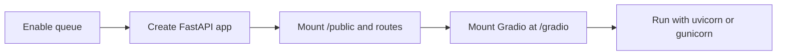
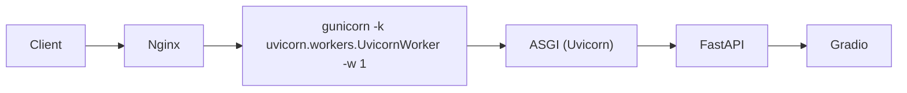
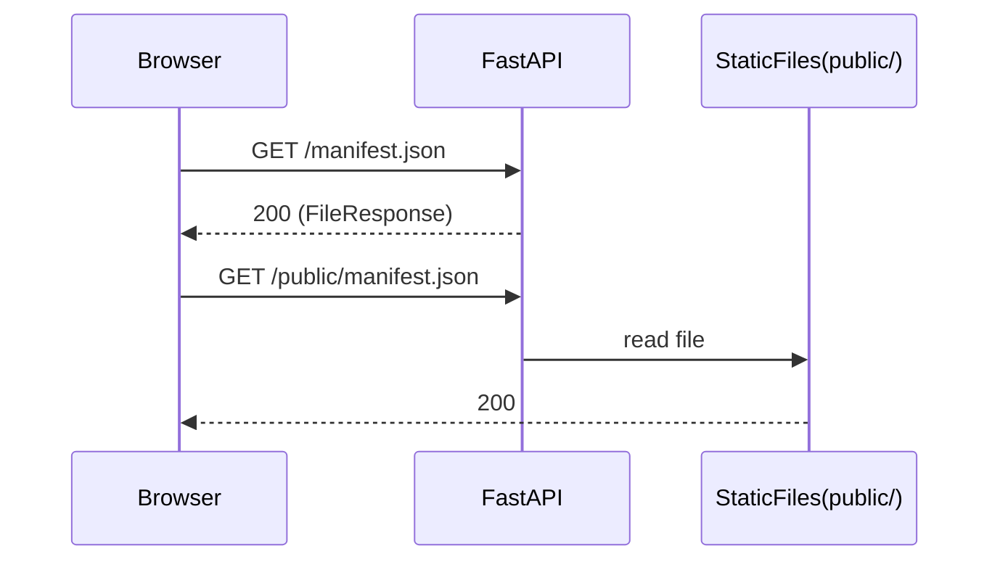
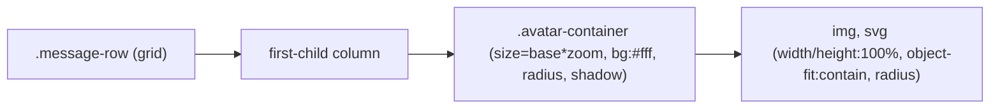
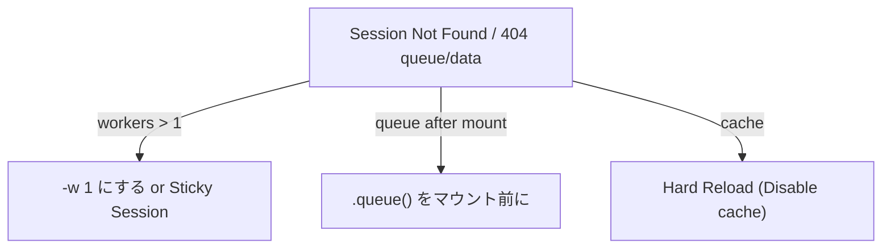
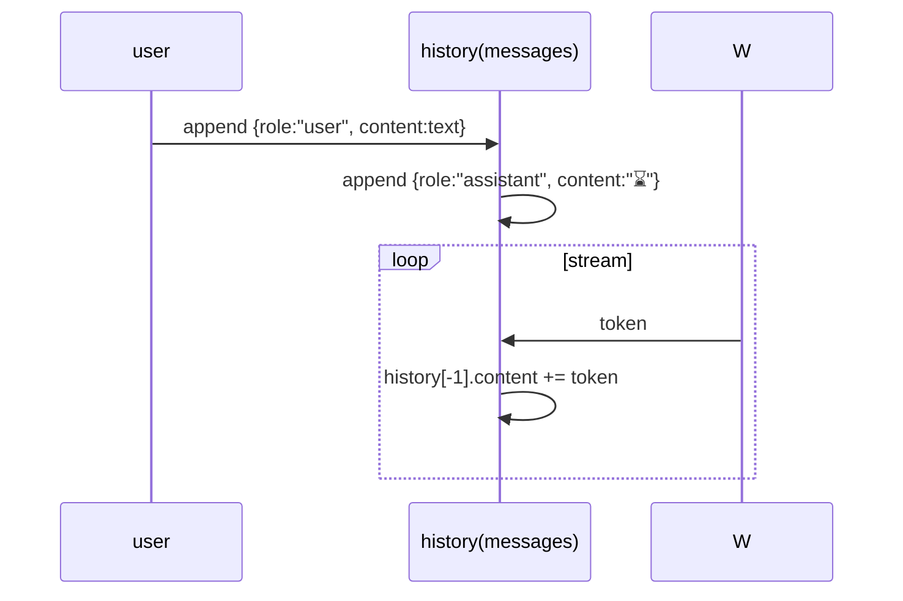

# Gradio × FastAPI 統合・運用プレイブック

本ドキュメントは、本リポジトリのデモアプリ（`app/demo.py`）で実施した設計・実装のノウハウをまとめたものです。Gradio を FastAPI 配下に安全に統合し、本番運用（Gunicorn/Uvicorn）に耐える構成をガイドします。

---

## 1. アーキテクチャ指針

- FastAPI をベースに据え、Gradio はサブパス（例: `/gradio`）へマウントする。
- 静的資産は `/public` に配信し、ルート要求される `/manifest.json` などは FastAPI で明示ルートを提供。
- Gradio Queue は「マウント前」に有効化する（セッション/キュー初期化のため）。

コード抜粋（実装済み）:

```python
api = FastAPI()

# Queue をマウント前に（重要）
demo.queue(max_size=16, default_concurrency_limit=4)

# 静的配信と manifest
public_dir = Path(__file__).resolve().parent.parent / "public"
api.mount("/public", StaticFiles(directory=str(public_dir)), name="public")

@api.get("/manifest.json")
def _manifest_file():
    return FileResponse(str(manifest_path), media_type="application/manifest+json")

# Gradio を /gradio にマウント、ルートはリダイレクト
gr.mount_gradio_app(api, demo, path="/gradio")

@api.get("/")
def _root():
    return RedirectResponse(url="/gradio")
```

---

## 2. なぜ `/gradio` マウントか

`/` に静的配信や Gradio を直マウントすると、FastAPI/Gradio の既存ルート（UI/JS/CSS/API）を上書きして壊す恐れがあります。サブパスへマウントし、ルートは 302 リダイレクトするのが安全です。

---

## 3. Queue とセッション安定化

- `.queue()` は必ず「マウント前」に呼ぶ。
- 本番は Gunicorn ワーカー数は 1 に固定する（SSE/Queue のセッション整合性のため）。並列性は Queue 側で担保。
- 併走数は `default_concurrency_limit` でデフォルト値を設定し、必要に応じてイベント毎に `concurrency_limit` を上書き可能。

チェックコマンド:

```bash
curl -I http://localhost:7860/gradio/gradio_api/queue/status   # 200 を期待
```

---

## 4. 本番起動（推奨）

```bash
# 直接
uvicorn app.demo:api --host 0.0.0.0 --port 7860 --workers 1 --proxy-headers --forwarded-allow-ips="*"

# Gunicorn（推奨）
gunicorn app.demo:api -k uvicorn.workers.UvicornWorker -b 0.0.0.0:7860 \
  -w 1 --threads 8 --timeout 0 --keep-alive 65 --forwarded-allow-ips="*"
```

メモ:
- `-w 1`（単一プロセス）でも、`default_concurrency_limit` で並列実行は可能です。
- 複数ワーカーにする場合は「スティッキーセッション（アフィニティ）」を用意しないと `Session Not Found` が発生します。

---

## 5. PWA manifest / favicon 提供

- `/public/manifest.json` を自動生成（未存在時）。`/manifest.json` には同ファイルを返すルートを提供。
- favicon は 2 経路で提供：
  - `<head>` に data URI SVG を挿入（即時反映）
  - `/favicon.ico` を FastAPI から返却（`public/` に無い場合は SVG を自動生成して仮配置）

確認:
```bash
curl -I http://localhost:7860/manifest.json          # 200
curl -I http://localhost:7860/public/manifest.json   # 200
curl -I http://localhost:7860/favicon.ico            # 200
```

---

## 6. Chatbot の `messages` 形式への移行

- `gr.Chatbot(type="messages")` を使用。履歴は OpenAI 風 `{role, content}` に統一。
- 入力時は `{"role":"user"}` と直後の `{"role":"assistant","content":"⌛ typing..."}` を push。
- ストリーム更新時は最後の assistant の `content` を差し替える。

抜粋:

```python
chat = gr.Chatbot(type="messages", ...)

def guard_and_prep(message, history):
    history = (history or []) + [
        {"role": "user", "content": text},
        {"role": "assistant", "content": "⌛ typing..."},
    ]
    ...

def stream_llm(go, prompt, history):
    for tok in llm_stream(prompt):
        body += tok
        history[-1]["content"] = body
        yield history, ...
```

---

## 7. アバターUI（白円を大きく、黒帯を縮小）

ポイント:
- `.avatar-container` に実寸（`--avatar-base * --avatar-zoom`）を与え、背景を白に。
- 余白リングは `box-shadow: 0 0 0 var(--avatar-ring) #fff` で可変化。
- 内部の `img/svg` は `width/height:100%` で円内に収める。`transform` 拡大は使用しない。

抜粋:

```css
.avatar-container{
  width: calc(var(--avatar-base) * var(--avatar-zoom));
  height: calc(var(--avatar-base) * var(--avatar-zoom));
  background:#fff; border-radius:9999px; box-shadow: 0 0 0 var(--avatar-ring) #fff;
}
.avatar-container > :is(img,svg){ width:100%; height:100%; border-radius:9999px; }
```

---

## 8. よくあるエラーと対処

### Session Not Found / 404（/queue/data）
- `.queue()` をマウント前に呼ぶ。
- 本番はワーカー 1。並列は Queue で担保。
- ブラウザのキャッシュを無効化してハードリロード。

### manifest.json の 404
- `/public` を静的配信し、`/manifest.json` で同ファイルを返す。
- `<head>` に `rel="manifest"` を付ける場合は `/public/manifest.json` を指すよう統一する（今回は FastAPI ルートを用意しているため省略可）。

### favicon 404
- `/favicon.ico` を FastAPI から提供。必要があれば `public/favicon.ico` を本物に差し替え可能。

---

## 9. 運用品質のためのコマンド

```bash
# キュー疎通
curl -I http://localhost:7860/gradio/gradio_api/queue/status

# 静的/manifest
curl -I http://localhost:7860/manifest.json
curl -I http://localhost:7860/public/manifest.json
curl -I http://localhost:7860/favicon.ico
```

---

## 10. スケール戦略（参考）

- 縦方向: `default_concurrency_limit` を増やす（I/O 中心は 4〜8 目安）。
- 横方向: ワーカー>1にする場合は、ロードバランサのスティッキーセッション必須（推奨は単一ワーカー＋Queue）。

---

## 11. 変更履歴（このリポジトリで実施した主な対応）

- Gradio を `/gradio` にマウント、`/` はリダイレクト。
- Queue をマウント前に有効化。`default_concurrency_limit` を導入。
- `/public` 静的配信、`/manifest.json` と `/favicon.ico` の提供。
- Chatbot を `type="messages"` に移行。履歴・ストリームの実装を変更。
- アバターUIを `.avatar-container` ベースへ統一し、白円リングの調整をCSSトークン化。

---

## 12. Mermaid 図版

### 12.1 全体アーキテクチャ


### 12.2 Chat 送信〜ストリームの流れ


### 12.3 起動順序（重要な初期化）


### 12.4 デプロイ・経路


### 12.5 manifest.json 解決フロー


### 12.6 アバター UI レイアウト


### 12.7 セッションエラーの切り分け


### 12.8 Chatbot messages 形式の更新モデル



---

## 13. Threads UI/UX 詳細設計（補遺）

本セクションは `docs/04.knowledge/gradio_fastapi_threads_ui_lessons.md` の知見を、設計に反映するための要点のみをまとめる。

### 13.1 スレッド生成タイミング
- 新規タブ表示時は作成しない。ユーザーの初回「非空メッセージ」送信時のみ作成。
- 「＋新規」はスレッドを作らず、`current_thread_id=""` にリセットして空チャットを見せる。
- 空メッセージ送信時は作成/保存を行わない。

### 13.2 UI 表示制御
- 空スレッド: サイドバー/タブとも「…」メニューを非表示。タブのアクションは削除のみ許可。
- 選択状態: 単一選択。＋新規直後は DOM の `.selected` を一括除去して表示のみ解除。

### 13.3 コンテキストメニュー/「…」
- 表示条件: 「選択中 かつ 非空」行のみ。右クリックメニューと動作は等価（rename/share/owner/delete）。
- 共有/オーナー変更は未実装トーストで明示（I/Fは分離）。

### 13.4 タイトル自動命名
- `TitleService.suggest_title_via_llm(text)`（現状スタブ: 先頭40文字＋…）。
- 初回（user 1件のみ）時に一度だけ rename を行う。

### 13.5 スクロール責務（構造で安定化）
- サイドバーコンテナ `#sidebar_col` は `overflow: hidden`。
- 一覧 `#threads_list` は `overflow-y: auto; max-height: calc(100vh - 220px)`（値はUI余白で調整可）。

### 13.6 キー操作
- 新規ショートカットは Alt+N のみ（Ctrl/Cmd+N はブラウザ予約により非対応）。

### 13.7 API/データ契約
- `list_threads()` は `id/title/archived` に加え `summary`（最新 user/assistant 優先、最大120）と `has_messages` を返す。UI はこれに依存。

### 13.8 アンチパターン（禁止）
- 送信前の多重自動作成や pending 状態の増加。
- タイミング依存の display:none やポーリング抑止。
- 選択状態の二重管理（状態＋DOM）。

### 13.9 テスト観点
- E2E: 初回送信でのみ作成、＋新規で選択解除、空スレッドでメニュー/ボタン非表示、一覧スクロールがチャットに被らない。
- 単体: TitleService の切詰め、`list_threads()` の `summary/has_messages` 生成。


