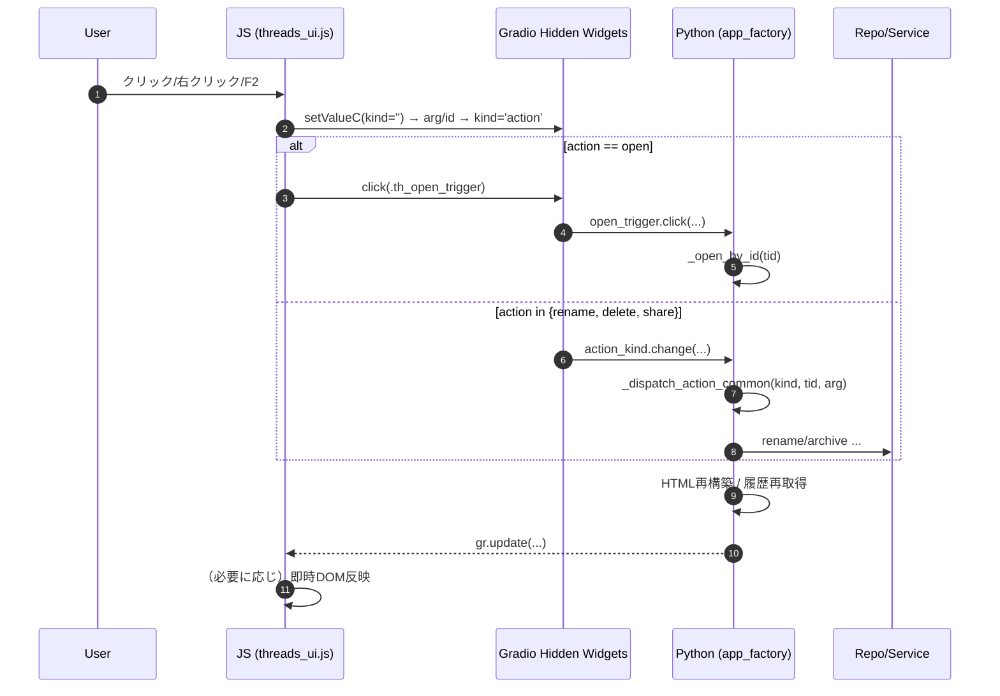

## Troubleshooting: Threads UI/UX リファクタと表示安定化（2025-08）

### 背景と要件
- 新規タブ表示時はスレッドを作成しない。ユーザーの初回「非空」メッセージ送信時のみ作成する。
- 「＋新規」でも同挙動（空チャットへリセットするだけ）。
- 空スレッドはメニュー非表示、タブ側のボタンは削除のみ表示。
- 選択→新規で選択が残らない（表示だけ解除）。
- スレッド一覧は将来スクロール対応を前提に、構造側で安定化。

### 主な問題と原因
1) 新規作成の量産
   - 送信前の多重自動作成・状態（pending 等）に起因。DRY/YAGNI違反。
2) 選択解除が残る
   - 状態同期の揺れ。DOM再描画タイミングに依存した解除が不安定。
3) リロード直後に一瞬だけ縦スクロールが見える
   - 初期描画（空）→一覧流入時に overflow の責務が不明確でコンテナ側に一時的スクロールが立つ。

### 対応（シンプル原則）
- スレッド作成は「初回非空メッセージ送信前の 1 カ所」だけで実施。空メッセージは作らない。
- 「＋新規」は空チャットへリセットし、JS 1 行で `.thread-link.selected` を全解除 → その後 `markSelectedLists('')` で再評価。
- スクロール責任は一覧へ固定:
  - `#sidebar_col { overflow: hidden }`
  - `#threads_list { overflow-y: auto; max-height: calc(100vh - 220px) }`
  - display:none などのタイミング依存抑止は不採用。

### 実装ポイント
- app_factory.py
  - 「＋新規」完了チェーンに `window.clearSelection()` 呼び出しのみ付与。
  - CSS でサイドバーと一覧の overflow 責務を固定。
- public/scripts/threads_ui.js
  - `window.clearSelection()` で DOM の selected を直接除去 → その後 `markSelectedLists('')` を軽く再適用。
  - 「…」は選択中かつ非空の行にだけ動的挿入。右クリックメニューは維持。

### アンチパターン（避ける）
- 自動作成の多重化・pending 状態の増加
- 選択状態の二重・三重同期（状態と DOM の両持ち）
- タイミング依存の display:none やポーリングでの抑止

### 今後
- スレッド一覧の高さ（`calc(100vh - 220px)`）は UI の余白に合わせて微調整可。
- スクロール動作の E2E 確認（大量スレッド時）を追加予定。

# Gradio + FastAPI Threads UI 知見集約（トラブルシューティング/設計ルール）

## 目的
本書は、Gradio UI（Shadow DOM）と FastAPI／SQLAlchemy によるスレッド機能実装で遭遇した課題と、その解決パターンを整理したもの。今後の変更時の指針・チェックリストの根拠とする。

---

## 設計ルール（要点）

- Shadow DOM 対応
  - 直接 `document.querySelector` に依存しない。`gradio-app.shadowRoot` 起点で走査する deep query ユーティリティ（qsDeep/qsWithin）を用意する。
  - クリック検知は document で委譲し、`event.composedPath()` から `.thread-link` を特定する。

- State 書き換えと change 発火（Gradio）
  - 値設定順は「kind を一時クリア → id/arg → kind=操作名」。2回目以降のクリックでも確実に change を発火させるための必須手順。
  - 連続操作時は `setTimeout(..., 0)` などで最小遅延を挟み、描画タイミングずれを吸収する。

- タブ遷移（Threads → Chat）
  - role=tab="チャット" を検索し、未選択なら `click()`。最大 3 回の軽量リトライで十分。過剰なループは作らない。

- 一覧の即時反映（サイドバー/タブ）
  - サーバで生成した同一 HTML をサイドバー／タブの両方に反映する設計を基本とする。
  - 右クリックのリネーム/削除は「サーバ更新」＋「イベントチェーンでタブ側も再描画」を1経路に統一。DOM 直書きは補助に留める。

- 右クリックメニュー UX
  - メニュー外クリック/ESC で閉じる。削除は confirm を挟む。リネームは現タイトルを初期値に提示。

- チャット履歴の保存
  - `guard_and_prep` でユーザ投稿、`stream_llm` 完了時にアシスタント発話を DB 保存。`current_thread_id` を確実に渡す。
  - メッセージ ID 生成関数をサービス内に集約（例: `_simple_ulid()`）。漏れがあると保存されない。

- DB/Repository 方針
  - 論理削除は UI 側フィルタではなく SELECT 側（`archived=False`）で排除し、UIの複雑化を避ける。

---

## 代表的な不具合と対策

1) 「2回目以降のクリックで反応しない」
- 原因: hidden の State に同じ値が連続で入り change が発火しない。
- 対策: kind を一旦空にしてから id/arg → kind=操作名 の順で設定。

2) 「タブ遷移しない／不安定」
- 原因: Shadow DOM 配下の role=tab 取得や選択状態の確認が不確実。
- 対策: role=tab だけを対象に検索→未選択なら click→再確認（最大 3 回）。

3) 「スレッドタブに即時反映されない」
- 原因: サイドバー側のみ再描画していた／イベントチェーン未接続。
- 対策: `action_kind.change(...).then(_refresh_threads_tab, ...)` を追加し、常に双方再描画。

4) 「チャットが保存されない」
- 原因: メッセージ ID 生成関数未定義（`_simple_ulid`）。
- 対策: サービス層で ID 生成関数を提供し、ユーザ/アシスタント双方で利用。

---

## デバッグ手順（Console 用スニペット）

- hidden 値の監視
```js
(() => {
  const sel = c => (window.qsDeep?.(c) || document.querySelector(c))?.querySelector('textarea, input');
  const k = sel('.th_action_kind'), i = sel('.th_action_id');
  ['input','change'].forEach(ev => {
    k?.addEventListener(ev, e => console.log(`[dbg] kind=${e.target.value}`));
    i?.addEventListener(ev, e => console.log(`[dbg] id=${e.target.value}`));
  });
})();
```

- タブ選択状態の確認
```js
(() => {
  const tabs = (window.qsaDeep?.('[role="tab"]') || Array.from(document.querySelectorAll('[role="tab"]')));
  tabs.forEach((t, i) => console.log(i, (t.textContent||'').trim(), t.getAttribute('aria-selected')));
})();
```

- スレッドタブの HTML 先頭断片（Shadow DOM）
```js
document.querySelector('gradio-app')?.shadowRoot?.getElementById('threads_list_tab')?.innerHTML.slice(0,200)
```

- メッセージ保存の確認
```bash
curl -s http://localhost:7860/api/threads/<TID>/messages | jq .
```

---

## 運用指針（最小で安全な変更）

- 1経路主義: 値設定→イベントチェーン→サーバ出力を両 UI に反映、の一本化。DOM 直書きは補助に限定。
- リトライ最小: タブ遷移のリトライは 3 回程度。増やしても価値が薄く複雑になる。
- UI の即時性は「then での再描画」で担保。個別の要素書き換えは最小限。

---

## 実装抜粋コード（最小セット）

> ここでは、今回の安定動作に至った実装の「要点のみ」をコード例として記録します。

### 1) JS: Shadow DOM対応のクリック検知とタブ遷移、hidden更新

```html
<!-- app_factory.py 内の head: deep query は Python 側でIIFE文字列として埋込み -->
<script>
// deep query (概略)
const qsDeep = (sel) => { /* gradio-app.shadowRoot を再帰探索して1つ返す */ };
const qsWithin = (root, sel) => { /* root配下をshadowRoot含め再帰探索 */ };

// hidden を安全に更新（2回目以降も反応するよう）
const setValueC = (cls, value) => {
  const root = qsDeep('.' + cls) || document.querySelector('.' + cls);
  const inp = root?.querySelector('textarea, input');
  if (!inp) return false;
  inp.value = value;
  inp.dispatchEvent(new Event('input', { bubbles: true }));
  inp.dispatchEvent(new Event('change', { bubbles: true }));
  return true;
};

// スレッドクリック → hidden(kind/id) 更新 → openトリガ →（Threadsタブなら）Chatタブ選択
document.addEventListener('click', (e) => {
  const path = e.composedPath?.() || [e.target];
  let el = null; for (const n of path) { if (n?.closest) { el = n.closest('.thread-link'); if (el) break; } }
  if (!el) return;
  const tid = el.getAttribute('data-tid') || '';
  setValueC('th_action_kind', '');
  setTimeout(() => { setValueC('th_action_id', tid); setValueC('th_action_kind', 'open'); }, 0);

  // Threadsタブ上なら Chat タブへ（最大3回程度）
  const ensureChatTab = (n=3) => {
    if (n <= 0) return;
    const tabs = (qsDeep('[role="tab"]') && [qsDeep('[role="tab"]')]) || Array.from(document.querySelectorAll('[role="tab"]'));
    const chat = tabs.find(t => (t.textContent||'').includes('チャット'));
    if (chat && chat.getAttribute('aria-selected') !== 'true') {
      try { chat.click(); } catch {}
      setTimeout(() => ensureChatTab(n-1), 80);
    }
  };
  const inThreadsTab = path.some(n => n && n.id === 'threads_list_tab');
  if (inThreadsTab) ensureChatTab(3);
});

// 右クリックメニュー: リネームは現タイトルを初期値、削除は確認ダイアログ
document.addEventListener('contextmenu', (e) => {
  // ... ensureCtx で .ctx-menu を作成し、クリック時に以下:
  // rename → prompt(currentTitle) → setValueC('th_action_arg', newTitle) → id → kind=rename
  // delete → confirm(title) OKなら → id → kind=delete
});
</script>
```

### 2) Python: イベントチェーンで一括再描画（サイドバー/タブ）

```python
# app_factory.py 主要部（概略）

def _build_threads_html(items: list[dict]) -> str: ...
def _refresh_threads_tab():
    items = ui_list_threads()
    html = _build_threads_html(items)
    return gr.update(value=html), items

# kind 変化で rename/delete を処理し、両リストへ同一HTML出力
def _dispatch_action_common(kind: str, tid: str, cur_tid: str, arg: str):
    if kind == 'rename' and tid and arg:
        with db_session() as s:
            ThreadRepository(s).rename(tid, arg)
        html = _build_threads_html(ui_list_threads())
        return cur_tid, gr.update(), gr.update(value=html)
    if kind == 'delete' and tid:
        with db_session() as s:
            ThreadRepository(s).archive(tid)
        # 選択解除と再描画
        new_cur = '' if cur_tid == tid else cur_tid
        html = _build_threads_html(ui_list_threads())
        new_hist = [] if new_cur == '' else ui_list_messages(new_cur)
        return new_cur, new_hist, gr.update(value=html)
    # open など他は省略

def _dispatch_action_both(kind: str, tid: str, cur_tid: str, arg: str):
    new_cur, new_hist, html = _dispatch_action_common(kind, tid, cur_tid, arg)
    return new_cur, new_hist, html, html  # サイドバー/タブ 両方に同一HTML

# Threadsタブ構築時に、kind変更のイベントにタブ再描画を then で接続
_evt_kind = action_kind.change(
    _dispatch_action_both,
    inputs=[action_kind, action_thread_id, current_thread_id, action_arg],
    outputs=[current_thread_id, chat, threads_html, threads_html_tab],
)
_evt_kind.then(_refresh_threads_tab, None, [threads_html_tab, threads_state2])

# サイドバーの「＋ 新規」も then でタブ側に反映
_evt_new = new_btn.click(_on_new, None, [threads_html, threads_state, current_thread_id, chat])
_evt_new.then(_refresh_threads_tab, None, [threads_html_tab, threads_state2])
```

### 3) Python: チャット保存（ユーザ/アシスタント）

```python
# chat_feature.py（概略）
from app.services.thread_service import ThreadService

def guard_and_prep(message: str, history, thread_id: str = ''):
    # ... 省略
    if thread_id:
        ThreadService().add_user_message(thread_id, text)
    return history, status, stop, send, msg, go, prompt

def stream_llm(go: bool, prompt: str, history, thread_id: str = ''):
    # ... ストリーム更新 ...
    if thread_id and body:
        ThreadService().add_assistant_message(thread_id, body)
    yield history, status, stop, send
```

### 4) Python: リポジトリの論理削除フィルタ

```python
# repositories/thread_repo.py（概略）
def list_recent(self, limit: int = 50) -> list[Thread]:
    stmt = (
        select(Thread)
        .where(Thread.archived.is_(False))  # ← UI側でのフィルタではなくSQLで排除
        .order_by(Thread.last_message_at.desc().nullslast(), Thread.created_at.desc())
        .limit(limit)
    )
    return list(self.session.scalars(stmt).all())
```


---

## JS↔Python 連携の実体と拡張手順（変更時の迷い防止ガイド）

本節は、JS から Python へ処理を橋渡しする「実体の場所」と「正しい変更手順」をまとめた実運用ガイド。変更時はここを出発点に確認する。

### どこで連携しているか（実体）
- 橋渡しコンポーネント（Gradio 隠し要素, `app/app_factory.py` 内）
  - `.th_action_id`（対象スレッドID, Textbox）
  - `.th_action_kind`（実行アクション, Textbox: open/rename/share/delete など）
  - `.th_action_arg`（追加引数, Textbox: rename の新タイトル等）
  - `.th_open_trigger`（open実行トリガ, Button）

- JS 側のディスパッチ（`public/scripts/threads_ui.js`）
  - open: `th_action_kind=''` → `th_action_id=tid` → `th_action_kind='open'` → `th_open_trigger.click()`
  - rename/share/delete: `th_action_kind=''` → `th_action_arg/id` → `th_action_kind='rename|share|delete'`
  - 右クリックメニュー（ensureCtx）で `data-act` ごとに上記の値セット手順を実行

- Python 側の受け口（`app/app_factory.py`）
  - open: `open_trigger.click(lambda tid: _open_by_id(tid), [action_thread_id], [current_thread_id, chat])`
  - kind change: `action_kind.change(_dispatch_action_both, inputs=[...], outputs=[...])`
  - 処理本体: `_dispatch_action_common(kind, tid, cur_tid, arg)`
    - rename → `ThreadRepository.rename(...)` → HTML再構築
    - delete → `ThreadRepository.archive(...)` → 選択解除/履歴再取得 → HTML再構築
    - open → `_open_by_id(tid)` で履歴取得
  - タブ側の確実な反映: `_evt_kind.then(_refresh_threads_tab, ...)`

### 拡張手順チェックリスト（新しいアクション追加時）
1) UIメニューに項目追加
   - `public/scripts/threads_ui.js` の `ensureCtx` 内 `innerHTML` に `<div class='ctx-item' data-act='your_action'>表示名</div>` を追加
   - クリックハンドラに `else if (act === 'your_action') { ... }` を追加
2) 値の設定順序を厳守（change を1回に集約）
   - `setValueC('th_action_kind', '')` → `setValueC('th_action_arg', ...)` → `setValueC('th_action_id', ...)` → `setValueC('th_action_kind', 'your_action')`
3) Python 側の分岐を実装
   - `app/app_factory.py` の `_dispatch_action_common` に `your_action` 分岐を追加
   - 必要に応じてリポジトリ/サービス層（`app/repositories/*`, `app/services/*`）を拡張
4) タブ/サイドバーの反映を確認
   - HTML再構築（`_build_threads_html`）で両 UI が同時に更新される設計を維持
   - `_evt_kind.then(_refresh_threads_tab, ...)` の後段が必要かチェック
5) ショートカット（任意）
   - キーボード操作（例: Delete キーで削除）を追加する場合は `document.addEventListener('keydown', ...)` に分岐を追加し、同じ順序で hidden 値を設定
6) テスト/動作確認
   - 2回目以降の操作やタブ遷移の安定性、DOM即時反映 → サーバ再フェッチで最終整合、を確認

### 処理フロー（Mermaid）


### よくある迷い/落とし穴（要点だけ再掲）
- kind の設定順序を誤ると change が発火せず「2回目以降が反応しない」
- Threads → Chat のタブ名が変わると `includes('チャット')` の検出に失敗（i18n時に注意）
- DOM 直書きは補助。最終整合はサーバ側の再フェッチ（`_refresh_threads_tab` など）で担保
- Shadow DOM のため通常の `querySelector` は不十分。deep query を必ず用意して使う


