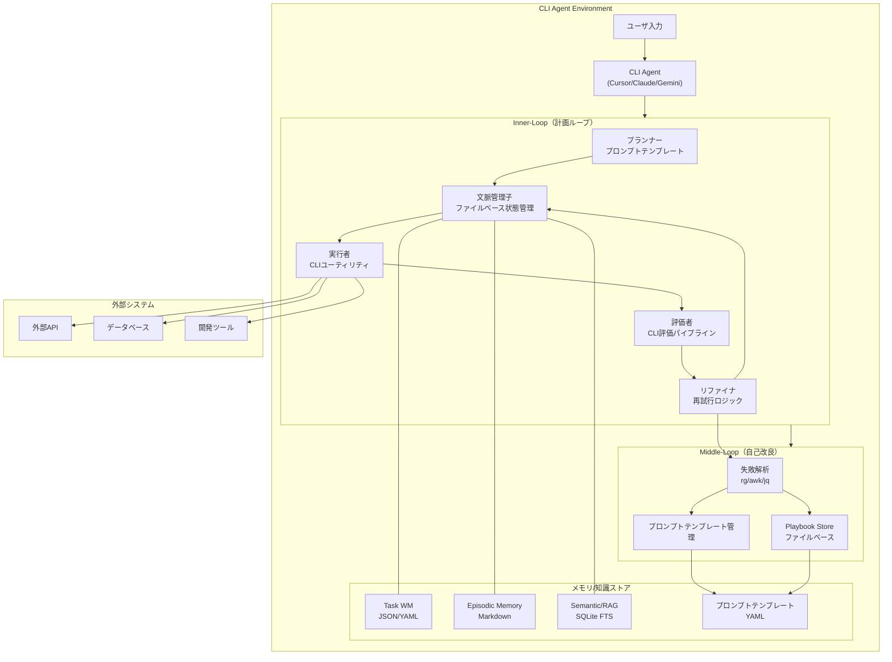

# CLI Agent実装設計書：自己改善型AIエージェントアーキテクチャ（CLIコア・Python非依存版）

[MVP/ポストMVPのスコープ定義](./mvp-scope.md) を参照してください。

## 1. エグゼクティブサマリー

本ドキュメントは、`architecture.md` の**3層ループ構造の自己改善型AIエージェント**を、**CLI Agent環境（Cursor CLI、Claude Code、Gemini CLI等）**で実現するための設計です。現時点の絶対方針として、コアは Python に依存しません（POSIXシェル + jq/yq/rg/awk/sed/sqlite3 FTS 等）。

### 1.1 結論

- **Inner-Loop（計画ループ）**: ✅ 完全実現可能 — ファイルベース状態管理 + プロンプトテンプレート + CLIパイプライン
- **Middle-Loop（自己改良）**: ⚠️ 部分的実現可能 — 失敗解析・テンプレ最適化はCLIで実施、学習系は将来プラグイン
- **Outer-Loop（モデル適応）**: ❌ 実現不可 — 代替としてテンプレート最適化/Few-shot最適化を採用

### 1.2 実現戦略

- コアは「プロンプト・コンテキスト最適化」と「CLIパイプライン」を中心に設計
- 高度機能（Chroma/FAISS/RL系等）は「将来プラグイン」として仕様のみ定義し、実装は本体から分離

### 1.3 自動初期化の方針

- 遅延初期化（Lazy Initialization）: 初回タスク実行時に自動で初期化を実行
- ユーザー作業ゼロ: 手動の初期設定は不要（ゼロセットアップ）
- 自動検出: 文脈管理子（ACE）が `.agent/` 構造の存在を検知し、必要に応じ自動生成

注: 実運用の各タスク（`.cursor/commands/agent/*.md`）は先頭にACEの自動初期化スニペットを常設し、手動初期化は不要です。

---

## 2. 現状分析：CLI Agentの制約と可能性（CLIコア方針）

### 2.1 CLI Agentの共通特性

| 特性 | 説明 | アーキテクチャへの影響 |
|------|------|----------------------|
| **単一セッション中心** | 対話的なタスク実行が基本 | Inner-Loop実現は可能、状態永続化は必要 |
| **ファイルシステムアクセス** | 読み書き可能 | ファイルベースの状態/記憶管理が可能 |
| **外部ツール呼び出し** | CLIツール実行が可能 | 評価/分析をCLIパイプラインで実現可能 |
| **会話履歴管理** | 限定的（セッション単位） | エピソード記憶をファイルで補完 |
| **モデル学習・更新** | 基本的に不可 | Outer-Loop不可 → テンプレ最適化で代替 |

### 2.2 既存実装パターンの調査結果

**重要な知見：**

1. **プログレッシブ・ルールローディング**
   - 必要なルールを必要なタイミングで読み込むことで、コンテキスト枯渇を防ぐ
   - CLI Agentのコンテキスト制限を考慮した重要な設計パターン

2. **ファイルベースのメモリ管理**
   - JSON/YAML/Markdown での状態・記憶管理が実用的

3. **エージェントの能力制限**
   - セキュリティリスクと暴走抑止のため、実行可能操作にガードレールが必要

### 2.3 技術的制約の整理（CLI版）

| 制約 | 影響 | 対策 |
|------|------|------|
| **コンテキストウィンドウ制限** | 長文脈が困難 | 文脈圧縮/プログレッシブローディング |
| **モデル更新不可** | Outer-Loop不可 | テンプレ最適化/Few-shot最適化で代替 |
| **LoRA生成不可** | 自己改良の限界 | プロンプトテンプレート管理で代替 |
| **リアルタイム学習不可** | オンライン学習不可 | バッチ知識蓄積 + 記録の再利用 |

---

## 3. 実現可能性評価：コンポーネント別（CLIコア）

### 3.1 Inner-Loop（計画ループ）

| コンポーネント | 実現可能性 | 実装アプローチ |
|---------------|----------|--------------|
| **プランナー** | ✅ 完全可能 | プロンプトテンプレート + Many-Shot ICL |
| **文脈管理子（ACE）** | ✅ 可能 | JSON/YAML状態管理 + プログレッシブローディング |
| **実行者** | ✅ 完全可能 | CLIワンライナー実行 |
| **評価者** | ✅ 可能 | CLI評価パイプライン（rg/awk/jq） |
| **リファイナ** | ✅ 可能 | 評価結果に基づく再試行/差分適用 |

### 3.2 Middle-Loop（自己改良ループ）

| コンポーネント | 実現可能性 | 実装アプローチ |
|---------------|----------|--------------|
| **失敗解析** | ✅ 可能 | rg/awk/jq によるログ解析 + パターン抽出 |
| **Prompt→LoRA生成** | ❌ 不可 | 代替: テンプレ版管理 + Few-shot最適化 |
| **Playbook Store** | ✅ 可能 | YAMLベースの手順/知識ストア |
| **Early Experience DB** | ✅ 可能 | 実行履歴の構造化保管（JSON/MD） |

### 3.3 Outer-Loop（モデル適応ループ）

| コンポーネント | 実現可能性 | 実装アプローチ |
|---------------|----------|--------------|
| **DPO/RLHF学習** | ❌ 不可 | 代替: テンプレ最適化/ルーブリック改善 |
| **LoRA統合** | ❌ 不可 | 代替: Few-shot例の蓄積・最適化 |
| **モデル更新** | ❌ 不可 | CLI Agentのバージョンに依存 |

### 3.4 補助システム

| コンポーネント | 実現可能性 | 実装アプローチ |
|---------------|----------|--------------|
| **メモリ/知識ストア** | ✅ 可能 | JSON/YAML/Markdown（ファイルベース） |
| **RAG Index（既定）** | ✅ 可能 | SQLite FTS（FTS5） |
| **高度RAG** | ◇ 将来プラグイン | Chroma/FAISS 等はプラグイン化 |
| **外部ツール連携** | ✅ 可能 | CLI標準機能で実装 |
| **観測/可視化** | ✅ 可能 | ログ + サマリ生成（jq） |

---

## 4. 設計案：CLI-Simplified Architecture（Python非依存）

### 4.1 全体アーキテクチャ



### 4.2 ディレクトリ構造（CLIコア）

```
.agent/
├── state/                    # 状態管理
│   ├── working_memory.json   # タスクワーキングメモリ
│   ├── current_context.yaml  # 現在の文脈
│   └── session_history/      # セッション履歴
│       └── YYYY-MM-DD-HHMMSS.json
│
├── generated/                # 自動生成物（ランタイム・非Git）
│   ├── rubrics/              # AutoRubric（RAS）の出力
│   └── artifacts/            # Artifacts Orchestrator の整形物
│
├── memory/                   # メモリ/知識ストア
│   ├── episodic/             # エピソード記憶（.md）
│   │   └── YYYY-MM-DD-*.md
│   ├── semantic/             # セマンティック記憶（RAG）
│   │   ├── fts.db            # SQLite FTSデータベース
│   │   └── documents/        # 元ドキュメント
│   └── playbooks/            # Playbook Store（.yaml）
│       └── *.yaml
│
├── prompts/                  # プロンプトテンプレート
│   ├── planner/
│   ├── executor/
│   ├── evaluator/            # 旧 evaluators/ を統合（テンプレのみ）
│   ├── analyzer/             # 旧 analyzers/ を統合（テンプレのみ）
│   └── templates.yaml        # テンプレート定義
│
├── config/
│   ├── agent_config.yaml     # エージェント設定
│   └── loop_config.yaml      # ループ設定
└── logs/
```

注: `bin/` は現行コアには含めません（完全ゼロスクリプト運用）。将来オプションとして導入可能ですが、本設計ではワンライナー手順のみを採用します。
注2: `.agent/` は各 Git worktree 専用とし、他ツリーと共有しない（`memory/semantic/fts.db` も共有禁止）。詳細は `worktree-guide.md` を参照。

#### 4.2.1 運用レイヤの棲み分け（公式）

- ランタイム（非Git・作業系）: `.agent/`
  - worktree ごとに独立。`state/`・`logs/`・`memory/semantic/fts.db`（RAG DB）等の実行時資産を保持
  - `generated/{rubrics,artifacts}` は RAS/AO の自動生成置き場（Git管理外・PR昇格対象候補）
  - Git にはコミットしない（`.gitignore` 対象）
- 共有正典（Git・再利用資産）: `agent/registry/`（単数形の `agent` を採用）
  - 構造（例）:
    - `agent/registry/prompts/`（`templates.yaml` 等）
    - `agent/registry/playbooks/`（*.yaml）
    - `agent/registry/rubrics/`（評価ルーブリック *.yaml）
    - `agent/registry/config/`（`*.defaults.yaml` の既定設定）
    - 任意: `agent/snapshots/YYYYMMDD-HHMM/`（`.agent/{config,prompts}` のエクスポート）
  - RAG のインデクシング対象外（設計資産の正典であり、検索は `docs/`/`memory-bank/` 側を用いる）
- 意思決定・進捗の記録（Git・人間向け）: `memory-bank/`
  - 目的/判断/進捗/既知課題などを時系列で管理

設定優先順位（レイヤリング）:

1) `.agent/config/*`（ローカル上書き）
2) `agent/registry/config/*.defaults.yaml`（共有既定）
3) 内蔵デフォルト（本書の記述）

同期モデル（正典とランタイム）:

- pull（共有→ローカル）: `agent/registry/** → .agent/**`
- push（ローカル→共有・昇格）: `.agent/** → PR → agent/registry/**`（昇格は評価ガバナンスの MUST を満たすこと）

備考:

- 運用タスクは Makefile ではなく、`.cursor/commands/agent/*.md` に手順（コマンド・前提・入出力・注意）として提供する。

### 4.3 Inner-Loop実装詳細（CLIパイプライン）

#### 4.3.1 プランナー

**実装アプローチ:**
- プロンプトテンプレート（YAML）
- Many-Shot ICL/Few-shot例の管理
- 重要制約の明示化（context圧縮）

**プロンプトテンプレート例:**
```yaml
planner_template:
  system: |
    You are a planning agent. Your task is to create a detailed plan for accomplishing the given goal.
    
    Use the following context and examples:
    {{ context }}
    {{ few_shot_examples }}
    
    Consider constraints: {{ constraints }}
  
  user: |
    Goal: {{ goal }}
    Current state: {{ current_state }}
    
    Generate a step-by-step plan.
```

#### 4.3.2 文脈管理子（ACE）

**実装アプローチ:**
- JSON/YAMLでの状態管理（jq/yq）
- プログレッシブ・ルールローディング
- RAG（SQLite FTS）連携による文脈拡張

**自動初期化チェック:**

ACEは状態ファイルへの初回アクセス時に以下を自動実行する（冪等・軽量）:

1. `.agent/` ディレクトリ構造の存在確認
2. 必要ディレクトリの自動生成
3. SQLite FTS データベースの初期化（未作成時のみ）
4. デフォルト設定ファイルの生成（未作成時のみ）
5. デフォルトプロンプトテンプレートの配置（未作成時のみ）

```bash
# ACE初期化チェック（遅延初期化）
[ -d .agent ] || mkdir -p .agent/{state/session_history,memory/{episodic,semantic/documents,playbooks},prompts/{planner,executor,evaluator,analyzer},config,logs} && \
[ -f .agent/memory/semantic/fts.db ] || sqlite3 .agent/memory/semantic/fts.db "CREATE VIRTUAL TABLE IF NOT EXISTS docs USING fts5(path, content);" && \
[ -f .agent/config/agent_config.yaml ] || printf "default_config: {}\n" > .agent/config/agent_config.yaml && \
[ -f .agent/config/loop_config.yaml ] || printf "default_loop_config: {}\n" > .agent/config/loop_config.yaml
```

**状態管理スキーマ:**
```json
{
  "task_id": "uuid",
  "goal": "string",
  "constraints": ["string"],
  "current_step": 0,
  "execution_history": [
    {
      "step": 1,
      "action": "string",
      "result": "string",
      "status": "success|failure"
    }
  ],
  "context_sources": {
    "working_memory": ["key1", "key2"],
    "episodic": ["episode_id"],
    "semantic": ["query1", "query2"],
    "playbook": ["playbook_id"]
  }
}
```

**Evaluator JSON I/O v2（省略可・後方互換）:**
rubric / artifacts を省略した場合、RAS/AO が自動生成・整合し評価を実行する。
```json
{
  "task_id": "uuid|省略可",
  "goal": "string",
  "auto": { "rubric": true, "artifacts": true, "weights": "learned|uniform" },
  "rubric": null,
  "artifacts": null,
  "budget": null
}
```
備考:
- v1はそのまま有効。rubric/artifacts を与えた場合は従来動作。
- 省略時のみ v2 の自動化（RAS/AO）が発動。


**並列運用指針（worktree）:**
- `.agent/` は worktree ごとに独立作成・使用（他ツリーと共有しない）
- 同一ツリーで複数タスクを併走する場合は、`task_id` ごとに WM/ログ/成果物のパスを完全分離
- RAG や Playbook の共有は「ファイルコピー」で行い、DB ファイルの共有は避ける
- 参考: `worktree-guide.md`

#### 4.3.3 実行者

**実装アプローチ:**
- インラインのCLIワンライナーで実行し、jqでJSON整形
- API呼出は curl 等を使用（必要最小限）

**実行フロー:**
1. プランナーが生成した計画を解析
2. 各ステップをCLI Agentに実行依頼
3. 結果を記録

#### 4.3.4 評価者（CLI評価パイプライン）

**実装アプローチ:**
- rg/awk によるアーティファクト検査 + jq でのJSONスコア出力
- ルーブリックは YAML で宣言し、判定条件をCLIで実装

備考（正典配置と運用）:
- ルーブリックの正典は `agent/registry/rubrics/` に配置する（Git 管理）
- 実行時は必要に応じて `.agent/` にコピーして使用（tasks参照）
- 正典への反映は PR による昇格（評価ガバナンスの MUST 条件を満たすこと）

**評価ワンライナー例（入出力プロトコル）:**
```bash
# 入力: {"task_id":"...","rubric":{...},"artifacts":[...]} をstdin
# 出力: {"ok":true,"scores":{...},"notes":[...]}
jq -r '.' \
| rg -n "(ERROR|FAIL|Timeout)" - || true \
| jq -R -s '{ok:true, scores:{basic:1.0}, notes:["cli-eval"]}'
```

**標準 Rubric YAML スキーマ（最小）:**
```yaml
id: code_quality_v1
version: 1
objectives:
  - name: spec_compliance
    weight: 0.4
  - name: robustness
    weight: 0.3
  - name: cost_efficiency
    weight: 0.2
  - name: runtime_reliability
    weight: 0.1
checks:
  - name: no_errors_in_logs
    detector: "rg -n '(ERROR|FAIL|Timeout)' logs/ | wc -l"
    expect: "== 0"
    weight: 0.4
  - name: spec_tests_pass
    detector: "bash tests/spec_run.sh"
    expect: "exit_code == 0"
    weight: 0.3
  - name: perturbation_robust
    detector: "bash tests/perturbation_suite.sh"
    expect: "exit_code == 0"
    weight: 0.2
  - name: budget_within_limit
    detector: "jq '.total_cost' artifacts/metrics.json"
    expect: "<= budget.max_cost"
    weight: 0.1
thresholds:
  pass_score: 0.9
  hard_fail_checks: ["no_errors_in_logs", "spec_tests_pass"]
```

**Evaluator JSON I/O 標準:**
```json
{
  "task_id": "uuid",
  "rubric": {"id":"code_quality_v1","version":1},
  "artifacts": ["logs/app.log","artifacts/metrics.json"],
  "budget": {"max_cost": 1.50}
}
```
→ 出力例:
```json
{
  "ok": true,
  "scores": {"total": 0.93, "spec_compliance": 1.0, "robustness": 0.9},
  "notes": ["no error found", "perturbation passed"],
  "evidence": {"failed_checks": [], "raw": {"no_errors_in_logs":0}},
  "metrics": {"cost": 1.12, "latency_ms": 8200},
  "rubric_id": "code_quality_v1@1"
}
```

**ロバスト性・反チート（最小導入）:**
- 摂動テスト（順序入替/シャッフル/軽微ノイズ/境界ケース）を標準スイート化
- ImpossibleBench 類似の「抜け道」検知を最小導入
- 監査ログに入力ハッシュ・rubric_id・template_id・スコア・コスト・根拠抜粋を必須保存

参照: `evaluation-governance.md`

#### 4.3.5 リファイナ

**実装アプローチ:**
- 評価結果に基づく再試行（テンプレ選択/パラメタ切替）
- 差分管理はファイルベースで記録（execution_history）
- 最大試行回数の制限

**プロモーション・ゲート（テンプレ昇格条件）:**
- MUST（全て）
  1) 回帰スイート合格（spec 準拠）
  2) 摂動ロバスト性合格（順序/ノイズ/境界ケース）
  3) コスト・SLO 内（予算/レイテンシ）
  4) ホールドアウト合格（リーク無し）
  5) 監査ログ完備（再現可能）
  6) HITL 承認（責任者サイン）
- SHOULD（望ましい）: A/B 反復 n≥5、有意優越（簡易基準で可）
- 不合格/劣化時は直前安定版へロールバック（自動降格）

参照: `evaluation-governance.md`

#### 4.3.6 自動生成コンポーネント（RAS / AO）

**目的:** ユーザ入力を Goal のみに限定し、rubric / artifacts を自動生成・自動整合・自動ブラッシュアップする。

- RAS（Rubric Auto Synthesis）
  - 入力: `goal`、ワークスペース信号（tests/logs/metrics など）、履歴
  - 出力: rubric YAML（`id/version/objectives/checks/thresholds`）
  - 乾式検証（detector dry-run）で不成立チェックを自動除外/無効化
  - 重み/閾値を実行履歴から漸進調整（均等→学習済み）
  - 保存: `.agent/generated/rubrics/<task_id>.yaml`、履歴: `.agent/state/rubric_history.json`

- AO（Artifacts Orchestrator）
  - 既定の出力先を提供: `logs/app.log`, `artifacts/metrics.json`
  - 収集・生成: エラーログ集約/最小メトリクス自動生成（取得不能時）
  - 整合: RAS が参照する `checks` と `artifacts` の一貫性を自動調整
  - 保存: `.agent/state/artifacts_map.json`, `.agent/logs/eval/*.json`

備考:
- v1 I/O 指定時はその値を尊重し、RAS/AO は無効。
- v2 で rubric/artifacts が省略された場合のみ RAS/AO が発動。

### 4.4 Middle-Loop実装詳細（CLI）

#### 4.4.1 失敗解析

**実装アプローチ:**
- ログ解析（rg/awk）
- エラーパターン抽出（正規表現）
- 改善点の特定（ルール化してYAML化）

**失敗解析ワンライナー例:**
```bash
rg -n "(ERROR|FAIL|Timeout)" logs/ \
| awk '{print $0}' \
| jq -R -s '{ok:true, errors: split("\n") | map(select(length>0))}'
```

#### 4.4.2 プロンプトテンプレート管理（LoRA代替）

**実装アプローチ:**
- 成功プロンプトのテンプレート化/バージョン管理
- タスクタイプ別/評価指標別の最適化

**テンプレート管理構造:**
```yaml
prompt_templates:
  - id: "planner_code_generation_v1"
    task_type: "code_generation"
    template: "..."
    success_rate: 0.85
    last_updated: "2025-01-XX"
  
  - id: "planner_code_generation_v2"
    task_type: "code_generation"
    template: "..."
    success_rate: 0.92
    last_updated: "2025-01-XX"
    improved_from: "planner_code_generation_v1"
```

### 4.5 メモリシステム実装

#### 4.5.1 ワーキングメモリ（Task WM）

**実装:**
- JSONファイルで状態管理（jq）
- タスクごとに個別ファイル

#### 4.5.2 エピソード記憶（Episodic Memory）

**実装:**
- Markdownで実行履歴を記録
- 時系列で整理
- 簡易全文検索はrgで対応

#### 4.5.3 セマンティック記憶（RAG: SQLite FTS 既定）

**既定:** SQLite FTS（FTS5）を使用。高度RAG（Chroma/FAISS等）は将来プラグイン。

**自動初期化:**

FTSデータベースはACEの自動初期化時に作成される。手動での初期化や投入は不要（必要に応じて実装側で自動投入を行う）。

**検索例:**
```bash
sqlite3 .agent/memory/semantic/fts.db "SELECT path, snippet(docs, 1, '[', ']', '…', 10) FROM docs WHERE docs MATCH \"$*\" LIMIT 5;"
```

---

## 4.6 Quickstart（Goalのみで実行）

前提: `jq` / `yq` / `rg` / `awk` / `sed` / `sqlite3` が利用可能。

```bash
# 初期化（冪等）
[ -d .agent ] || mkdir -p .agent/{state/session_history,generated/{rubrics,artifacts},memory/{episodic,semantic/documents,playbooks},prompts/{planner,executor,evaluator,analyzer},config,logs}
[ -f .agent/memory/semantic/fts.db ] || sqlite3 .agent/memory/semantic/fts.db "CREATE VIRTUAL TABLE IF NOT EXISTS docs USING fts5(path, content);"

# Goalのみで実行（rubric/artifacts は自動: RAS/AO）
GOAL="あなたのGoal"
TASK_ID="$(date +%s)-$RANDOM"

mkdir -p .agent/logs/eval .agent/generated/{rubrics,artifacts} .agent/state

printf '{
  "task_id": "%s",
  "goal": "%s",
  "auto": {
    "rubric": true,
    "artifacts": true,
    "weights": "learned"
  },
  "rubric": null,
  "artifacts": null,
  "budget": {
    "max_cost": 0
  }
}
' "$TASK_ID" "$GOAL" \
| tee .agent/logs/eval/input.json \
| jq -r '.'

rg -n "(ERROR|FAIL|Timeout)" .agent/logs || true >/dev/null

jq -n --arg task_id "$TASK_ID" '{
  ok: true,
  scores: {
    total: 1.0
  },
  notes: ["cli-eval (skeleton)"],
  evidence: {
    failed_checks: [],
    raw: {}
  },
  metrics: {
    cost: 0,
    latency_ms: 0
  },
  rubric_id: "skeleton_v0@0",
  task_id: $task_id
}' | tee .agent/logs/eval/result.json
```

結果:
- 実行ログ: `.agent/logs/`
- 評価入出力スナップショット: `.agent/logs/eval/*.json`
- 生成Rubric: `.agent/generated/rubrics/*.yaml`

関連: `quickstart_goal_only.md`, `evaluation-governance.md`

---

## 5. 技術スタック（更新）

### 5.1 推奨ツール・ライブラリ（コア）

| カテゴリ | ツール | 用途 | 理由 |
|---------|--------|------|------|
| **CLI Agent** | Cursor CLI / Claude Code | メインエージェント | ツール統合が容易 |
| **状態管理** | jq / yq | JSON/YAML操作 | 軽量・高速 |
| **検索/抽出** | ripgrep(rg) / awk / sed | パターン抽出 | 高速/柔軟 |
| **RAG（既定）** | sqlite3 (FTS5) | FTS全文検索 | 依存最小 |
| **構成管理** | YAML / JSON | テンプレ管理 | 構造化しやすい |

### 5.2 開発環境

- **言語**: POSIX sh（Bash互換）
- **ツール**: jq, yq, ripgrep, awk, sed, sqlite3, fdfind/eza
- **バージョン管理**: Git
 - **方針**: スクリプト不要（すべてワンライナーで運用）

### 5.3 依存関係

- コアに言語ランタイム依存なし（Python/Node等に非依存）
- Node/Python 等での拡張は「将来プラグイン」として各プロジェクトで判断

---

## 6. 実装ロードマップ（更新）

### Phase 1: 基盤構築（1-2週間）

- [ ] `.agent/` コア構造（state/memory/prompts/config/logs）
- [ ] WM/履歴のCRUDワンライナー整備
- [ ] プロンプトテンプレート骨子
- [ ] SQLite FTS 初期化ワンライナー整備

- [ ] 自動初期化システムの実装（ACE初回アクセス時）
  - [ ] ディレクトリ構造の自動生成
  - [ ] SQLite FTS の自動初期化
  - [ ] デフォルト設定ファイルの自動生成
  - [ ] 初期化エラーハンドリング

**成果物:**
- CLI骨格（状態/評価/解析/RAGの最小実装）

### Phase 2: Inner-Loop実装（2-3週間）

- [ ] プランナー/実行者テンプレ強化
- [ ] 文脈管理子（ACE）実装
- [ ] ACEの自動初期化チェック組み込み
- [ ] 評価ワンライナー整備
- [ ] 失敗解析ワンライナー整備
- [ ] ループ制御ロジック

**成果物:**
- Inner-Loop動作プロトタイプ（CLIのみで完結）

### Phase 3: Middle-Loop実装（2-3週間）

- [ ] 失敗解析のルール化/自動提案
- [ ] プロンプトテンプレ管理/評価メトリクス導入
- [ ] Playbook Storeの整備
- [ ] Early Experience DB（履歴→知識化）

**成果物:**
- Middle-Loop動作プロトタイプ（CLI）
- テンプレ最適化の運用基盤

### Phase 4: メモリシステム統合（1-2週間）

- [ ] SQLite FTS 運用フロー確立/更新バッチ
- [ ] エピソード記憶の検索性向上
- [ ] RAGワンライナー運用整備

**成果物:**
- CLI前提で完結するメモリ/RAGシステム

### Phase 5: 最適化と実用化（2-3週間）

- [ ] パフォーマンス最適化（rg/awk/jq/SQLite）
- [ ] エラーハンドリング/ログ整備
- [ ] ドキュメント/使用例整備

**成果物:**
- 実用可能なCLIシステム
- ドキュメント/運用手順

---

## 7. プラグイン仕様（将来拡張・実装は別配布）

- 目的: コアを汎用CLIに限定しつつ、高度機能を後付け可能にする
- 配置: `plugins/<plugin_id>/plugin.yaml`（実装は本体外）
- 種別: `semantic_search | evaluator | analyzer | exec_tool`
- エントリポイント: `entrypoint` は実行コマンド/パス（相対可）
- I/O: 標準入出力は JSON（UTF-8）、改行区切りなし。終了コード0=成功

```yaml
# plugins/example/plugin.yaml
id: example.evaluator.v1
kind: evaluator
entrypoint: "./run"     # 実装は本体外。ここでは仕様のみ定義
stdin_schema: agent.v1.EvalRequest
stdout_schema: agent.v1.EvalResult
schemas:
  EvalRequest:
    type: object
    required: [task_id, rubric, artifacts]
  EvalResult:
    type: object
    required: [ok, scores]
```

---

## 8. 実装上の課題と対策

### 8.1 コンテキストウィンドウ制限

**課題**: コンテキスト制限

**対策:**
- プログレッシブ・ルールローディング
- 文脈圧縮/要約
- 重要情報の優先ロード

### 8.2 状態の永続化

**課題**: セッション間の継続性

**対策:**
- ファイルベースの状態管理
- セッション履歴の明確化

### 8.3 評価の自動化

**課題**: 自動評価の信頼性

**対策:**
- ルーブリック定義の明確化（YAML）
- CLIパイプラインの基準化
- 結果のJSON化と再現性確保

**監査・承認フロー（運用）:**
- 監査ログに以下を必須記録: `task_id`, 入力ハッシュ, `rubric_id`, `template_id`, `scores`, 失敗チェック一覧, 成果物ハッシュ, コスト/レイテンシ, 判定根拠抜粋, モデル/バージョン
- テンプレ昇格時は HITL（人間承認）を必須とし、承認者/理由/チケットIDを記録
- 詳細: `evaluation-governance.md`

### 8.4 プロンプト最適化

**課題**: 学習系が使えない

**対策:**
- A/Bテスト的最適化
- 成功例の蓄積/選抜
- テンプレのバージョン管理

### 8.5 自動初期化の信頼性

**課題**: 初期化失敗時の挙動とエラーハンドリング

**対策:**
- 冪等性の保証（既存構造があればスキップ）
- 失敗時の明確なエラー通知
- 部分初期化でも安全に動作可能な設計
- 権限/環境エラーの検出とガイダンス

---

## 9. 期待される効果と制限

### 9.1 期待される効果

1. **タスク成功率の向上**: Inner-Loopの計画・実行・評価・改善サイクル
2. **知識の蓄積**: Middle-Loopによる経験の学習と再利用
3. **効率化**: CLIパイプラインによる自動化
4. **ゼロセットアップ**: 初期設定不要で即時に利用開始可能

### 9.2 制限事項

1. **モデル更新不可**: Outer-Loopの完全実現は不可能
2. **LoRA生成不可**: プロンプト最適化で代替
3. **リアルタイム学習不可**: バッチ処理による知識蓄積

### 9.3 将来の拡張可能性

- モデル更新APIの利用（提供される場合）
- 外部学習サービス/高度RAGのプラグイン統合
- RAGスキーマ・検索戦略の最適化

---

## 10. 次のステップ

1. **プロトタイプ開発**: Phase 1の基盤構築から開始
2. **既存CLI Agentとの統合テスト**: Cursor CLI等での動作確認
3. **ユースケースの定義**: 具体的タスクでの実証実験
4. **フィードバックループ**: 実装→テスト→改善のサイクル

---

## 11. 参考資料

- [architecture.md](./architecture.md) - 元のアーキテクチャ設計
- [プログレッシブ・ルールローディング](https://zenn.dev/shinpr_p/articles/80cef7ed8421a8) - CLI Agent設計パターン
- [SQLite FTS5](https://www.sqlite.org/fts5.html) - FTSドキュメント

---

**作成日**: 2025-01-XX  
**最終更新**: 2025-11-03  
**ステータス**: 設計更新 - CLIコア準拠（Python非依存）

