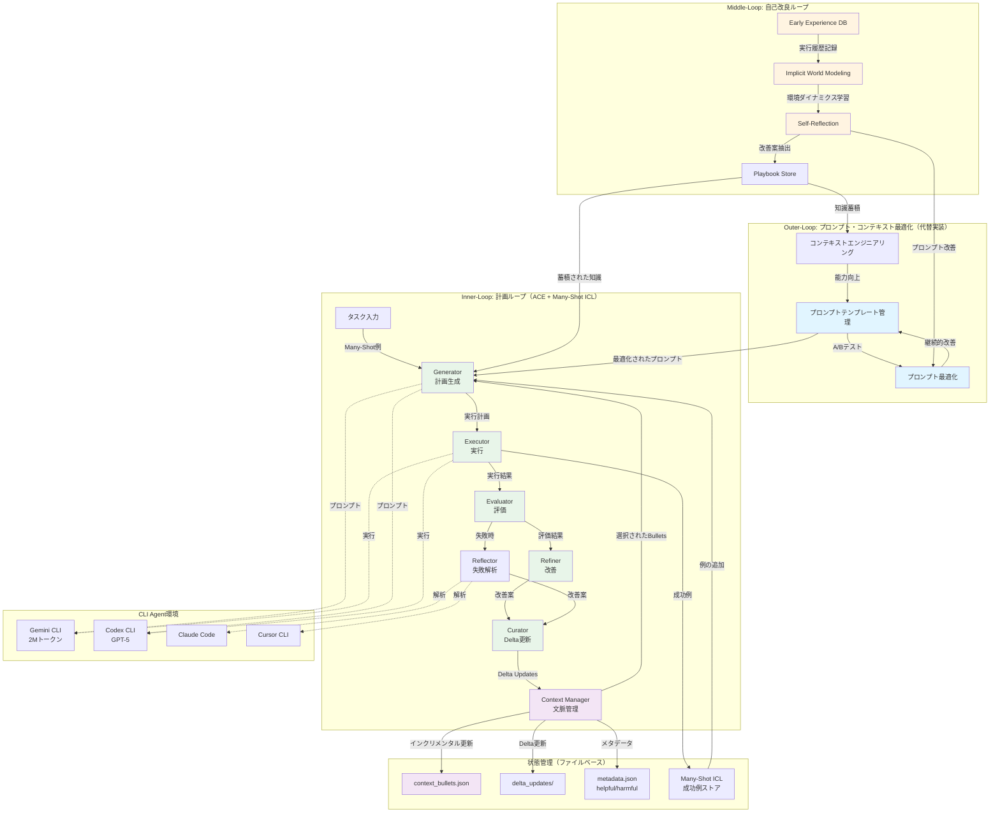
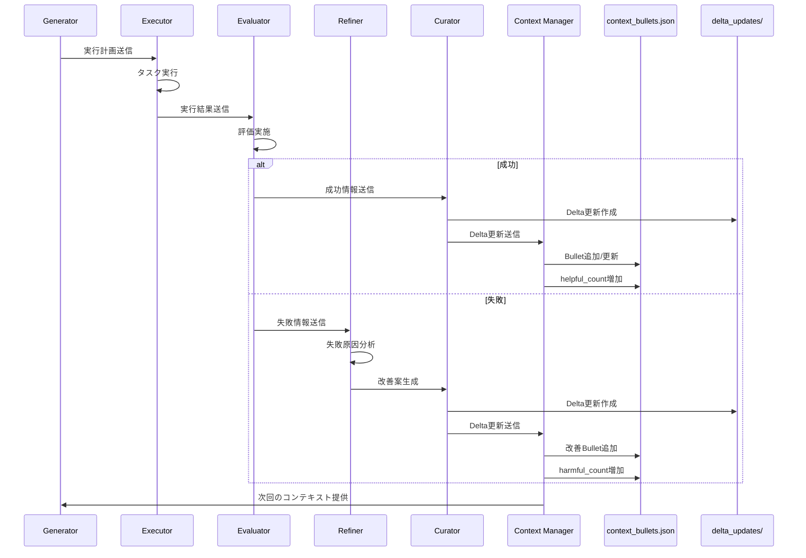
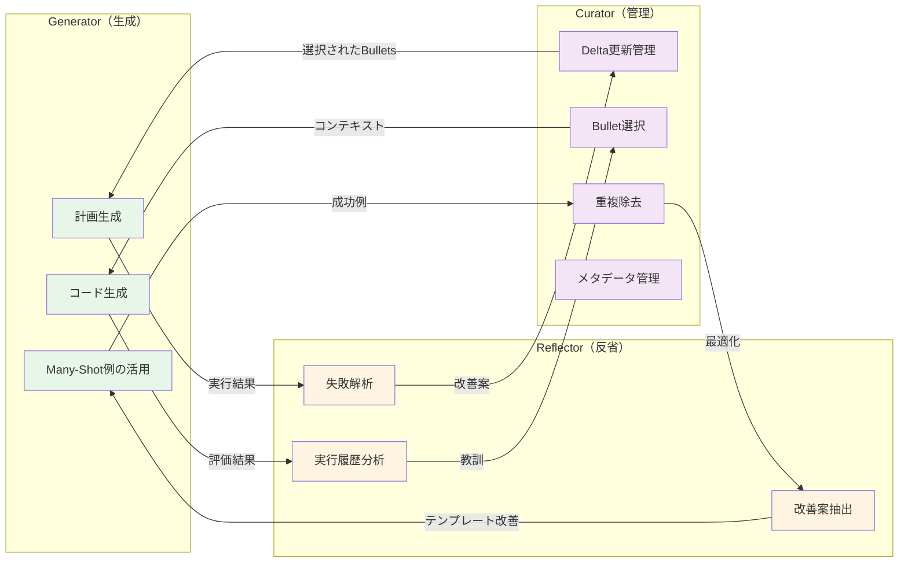

# CLI Agent実装フィジビリティスタディ報告書

## 1. エグゼクティブサマリー

本報告書は、`cli-implementation-design.md`で定義された**3層ループ構造の自己改善型AIエージェント**を、**CLI Agent環境（Claude Code、Codex CLI、Gemini CLI、Cursor CLI）**で実現するための**フィジビリティチェック**と**最適な実現方法**の調査結果をまとめたものです。

### 1.1 主要結論

1. **Inner-Loop（計画ループ）**: ✅ **完全実現可能** - ファイルベース状態管理 + プロンプトエンジニアリング
2. **Middle-Loop（自己改良）**: ⚠️ **部分的実現可能** - プロンプト最適化・知識蓄積は可能、LoRA生成は不可
3. **Outer-Loop（モデル適応）**: ❌ **実現不可** - 代替としてプロンプトテンプレート最適化を採用

### 1.2 実現戦略（更新版）

**「モデル更新」ではなく「プロンプト・コンテキスト最適化」に焦点を当てた簡略化版アーキテクチャ**を実装します。さらに、最新の研究動向（ACE、Many-Shot ICL、Early Experience）を踏まえた**実装可能な最適化手法**を提案します。

### 1.3 前提条件（運用）
- 学習不可 → テンプレート最適化（Few/Many-shot・文脈最適化）を採用
- テンプレ昇格はプロモーション・ゲート必須（回帰/ロバスト/コスト/ホールドアウト/監査/HITL）
- 並列運用は Git worktree を前提とし、各ツリーで `.agent/`（含 FTS DB）を独立運用
- 参照: `evaluation-governance.md`, `worktree-guide.md`

---

## 2. 主要論文の調査結果

### 2.1 主要論文のURLと要点

#### 2.1.1 Agentic Context Engineering (ACE)
- **論文**: "Agentic Context Engineering: Evolving Contexts for Self-Improving Language Models"
- **URL**: NotebookLM内にHTML保存版あり（arxiv番号は未確認だが、2025年公開の最新研究）
- **要点**:
  - **Incremental Delta Updates**: モノリシックな書き換えではなく、構造化されたインクリメンタル更新
  - **Grow-and-Refine**: コンテキストの拡張とリファインメントのバランス
  - **Generator-Reflector-Curator**: 3つの役割分担によるエージェント設計
  - **実装可能性**: ✅ CLI環境で実現可能（ファイルベースの状態管理 + プロンプトテンプレート）

#### 2.1.2 Many-Shot In-Context Learning
- **論文**: "Many-Shot In-Context Learning"
- **URL**: https://arxiv.org/pdf/2404.11018.html
- **要点**:
  - 数百から数千のショットでのICLが効果的
  - Reinforced ICL（モデル生成のCoT）とUnsupervised ICLの有効性
  - Few-shotよりMany-shotで大幅な性能向上
  - **実装可能性**: ✅ CLI環境で実現可能（長文脈対応のCLI Agent + プロンプト管理）

#### 2.1.3 Early Experience for Language Agent Learning
- **論文**: "Agent Learning via Early Experience"
- **URL**: https://arxiv.org/pdf/2510.08558.html
- **要点**:
  - **Implicit World Modeling**: 収集した状態で環境ダイナミクスをモデル化
  - **Self-Reflection**: エージェント自身の行動から学習
  - 報酬なしでも効果的な学習が可能
  - **実装可能性**: ✅ CLI環境で実現可能（実行履歴の記録・分析）

#### 2.1.4 Drag-and-Drop LLMs (Prompt-to-Weights)
- **論文**: "Drag-and-Drop LLMs: Zero-Shot Prompt-to-Weights"
- **URL**: NotebookLM内に保存（arxiv:2506.16406と推測）
- **要点**:
  - プロンプトを直接重みへ写像する手法
  - ICLとパラメトリック学習の橋渡し
  - **実装可能性**: ❌ CLI環境では実現不可（モデル更新が必要）

---

## 3. CLI Agentの比較と選定

### 3.1 各CLI Agentの特徴

| CLI Agent | 開発元 | 主な特徴 | コスト | 実装適合度 |
|-----------|--------|---------|--------|-----------|
| **Claude Code** | Anthropic | 対話の自然さ、高精度なコード補完 | 月額$20+ | ⭐⭐⭐⭐ |
| **Codex CLI** | OpenAI | GPT-5搭載、強力なコード生成 | ChatGPT Plus前提 | ⭐⭐⭐⭐⭐ |
| **Gemini CLI** | Google | 無料、2Mトークンコンテキスト、Google連携 | 無料 | ⭐⭐⭐⭐⭐ |
| **Cursor CLI** | Cursor IDE | VS Code統合、初心者向け | 無料/月額$20 | ⭐⭐⭐ |

### 3.2 推奨選定方針

**ハイブリッドアプローチ**を推奨：

1. **メイン開発**: **Gemini CLI** または **Codex CLI**
   - Gemini CLI: 無料で2Mトークンコンテキスト、初期開発に最適
   - Codex CLI: GPT-5の高精度、本番環境に適する

2. **補助ツール**: **Claude Code** または **Cursor CLI**
   - 特定タスクでの補完的利用
   - プロンプト最適化の検証

---

## 4. アーキテクチャ構成図

### 4.0 全体アーキテクチャ概要

以下のmermaid図は、本報告書で提案する**3層ループ構造の自己改善型AIエージェント**の全体アーキテクチャを示しています。



### 4.0.1 データフロー詳細

以下の図は、Delta Updatesとコンテキスト管理の詳細なデータフローを示します。



### 4.0.2 Generator-Reflector-Curator パターン

ACE論文に基づく3つの役割分担の詳細です。



---

## 5. フィジビリティチェック：更新版実装アプローチ

### 5.1 Inner-Loop（計画ループ）の実装

#### 5.1.1 ACEベースの文脈管理実装

**実現可能性**: ✅ **100%**

**実装アプローチ**:
- **Delta Updates**: JSON/YAMLベースの構造化されたインクリメンタル更新
- **Generator-Reflector-Curator**: CLI Agentの3つの役割分担
  - Generator: CLI Agentの標準機能で実現
  - Reflector: 失敗解析スクリプト + プロンプトテンプレート
  - Curator: ファイルベースの状態管理システム

**技術スタック**:
```python
# 実装例のコンセプト
.agent/
├── state/
│   ├── context_bullets.json  # ACEのBullet構造
│   ├── delta_updates/        # インクリメンタル更新
│   └── metadata.json         # メタデータ（helpful/harmfulカウンター）
```

#### 5.1.2 Many-Shot ICLの実装

**実現可能性**: ✅ **100%**

**実装アプローチ**:
- Gemini CLIの2Mトークンコンテキストを活用
- プロンプトテンプレートにMany-Shot例を埋め込み
- 成功例の蓄積と再利用

**技術スタック**:
```yaml
# prompts/planner/many_shot_examples.yaml
examples:
  - task_type: "code_generation"
    examples: [...]
    shot_count: 100-1000
```

### 5.2 Middle-Loop（自己改良ループ）の実装

#### 5.2.1 Early Experienceベースの学習

**実現可能性**: ✅ **80%**

**実装アプローチ**:
- **Implicit World Modeling**: 実行履歴から環境ダイナミクスを学習
- **Self-Reflection**: 失敗ケースの分析と改善案の抽出
- Playbook Storeへの知識蓄積

**技術スタック**:
```python
# analyzers/early_experience.py
class EarlyExperienceLearner:
    def collect_states(self, execution_trace):
        # 状態収集
        pass
    
    def build_world_model(self, states):
        # 環境ダイナミクスのモデル化
        pass
    
    def reflect_on_actions(self, trace):
        # 自己反省による改善案抽出
        pass
```

#### 5.2.2 プロンプトテンプレート最適化（LoRA代替）

**実現可能性**: ✅ **100%**

**実装アプローチ**:
- 成功したプロンプトをテンプレート化
- A/Bテスト的な比較
- バージョン管理システム

**技術スタック**:
```yaml
# prompts/templates.yaml
prompt_templates:
  - id: "planner_code_gen_v1"
    success_rate: 0.85
    improved_from: null
  
  - id: "planner_code_gen_v2"
    success_rate: 0.92
    improved_from: "planner_code_gen_v1"
```

### 5.3 Outer-Loop（モデル適応ループ）の代替実装

**実現可能性**: ❌ **モデル更新不可** → ✅ **プロンプト最適化で代替**

**代替アプローチ**:
- Few-shot例の蓄積・最適化
- プロンプトテンプレートの継続的改善
- コンテキストエンジニアリングによる能力向上

---

## 6. 実装可能な最適化手法（論文ベース）

### 6.1 ACEのIncremental Delta Updates

**実装方法**:
```python
# state/context_manager.py
class ContextManager:
    def add_delta(self, delta_entry):
        """Delta更新を追加"""
        # 構造化されたBullet追加
        pass
    
    def merge_deltas(self, deltas):
        """Delta更新をマージ"""
        # 非LLMベースの軽量マージ
        pass
    
    def deduplicate(self):
        """セマンティック埋め込みによる重複除去"""
        pass
```

**メリット**:
- モノリシックな書き換えより86.9%のレイテンシ削減（ACE論文より）
- コスト削減とスケーラビリティ向上

### 6.2 Many-Shot ICLの活用

**実装方法**:
- Gemini CLIの長文脈を活用
- 成功例を蓄積し、Many-Shot例として活用
- Few-shotからMany-shotへの移行で性能向上

**メリット**:
- Few-shotより大幅な性能向上（論文より）
- ファインチューニングに匹敵する性能

### 6.3 Early Experienceの実装

**実装方法**:
```python
# memory/early_experience.py
class EarlyExperienceDB:
    def record_execution(self, trace):
        """実行履歴を記録"""
        pass
    
    def extract_lessons(self, traces):
        """実行履歴から教訓を抽出"""
        pass
    
    def apply_to_context(self, lessons):
        """コンテキストに適用"""
        pass
```

**メリット**:
- 報酬なしでも効果的な学習
- エージェント自身の行動から継続的改善

---

## 7. 実装ロードマップ（更新版）

### Phase 1: 基盤構築（1-2週間）
- [ ] `.agent/` ディレクトリ構造の作成
- [ ] ACEベースのDelta Updateシステム実装
- [ ] プロンプトテンプレート管理システム
- [ ] 基本的なCLIラッパー

### Phase 2: Inner-Loop実装（2-3週間）
- [ ] Many-Shot ICLの統合
- [ ] Generator-Reflector-Curator実装
- [ ] 実行者の実装
- [ ] 評価者の実装
- [ ] リファイナーの実装

### Phase 3: Middle-Loop実装（2-3週間）
- [ ] Early Experience DB実装
- [ ] Implicit World Modeling実装
- [ ] Self-Reflection実装
- [ ] プロンプトテンプレート最適化システム

### Phase 4: メモリシステム統合（1-2週間）
- [ ] Chroma DB統合
- [ ] エピソード記憶システム
- [ ] セマンティック検索
- [ ] Delta Updateの自動マージ

### Phase 5: 最適化と実用化（2-3週間）
- [ ] パフォーマンス最適化
- [ ] エラーハンドリング強化
- [ ] ドキュメント作成
- [ ] 使用例・チュートリアル

---

## 8. 技術的な制約と対策

### 8.1 コンテキストウィンドウ制限

**課題**: CLI Agentのコンテキスト制限

**対策**:
- Gemini CLIの2Mトークンコンテキストを活用
- Delta Updateによる効率的なコンテキスト管理
- プログレッシブ・ルールローディング

### 8.2 モデル更新不可

**課題**: Outer-Loopの完全実現が不可能

**対策**:
- プロンプトテンプレート最適化で代替
- Many-Shot ICLによる能力向上
- ACEベースのコンテキスト最適化

### 8.3 リアルタイム学習不可

**課題**: オンライン学習が不可

**対策**:
- バッチ処理による知識蓄積
- Early Experience DBによる経験の蓄積
- Delta Updateによる効率的な更新

---

## 9. 期待される効果と制限

### 9.1 期待される効果（論文ベース）

1. **ACEによる性能向上**: +10.6% (agents), +8.6% (domain-specific)
2. **Many-Shot ICLによる性能向上**: Few-shotより大幅向上
3. **Early Experienceによる改善**: 報酬なしでも効果的な学習
4. **コスト削減**: 86.9%のレイテンシ削減（ACE論文より）

### 9.2 制限事項

1. **モデル更新不可**: Outer-Loopの完全実現は不可能
2. **LoRA生成不可**: プロンプト最適化で代替
3. **リアルタイム学習不可**: バッチ処理による知識蓄積

### 9.3 将来の拡張可能性

- モデル更新APIの利用（将来的に提供される場合）
- 外部学習サービスの統合
- より高度なRAGシステムへの移行

---

## 10. Pythonコードの必要性に関する考察

### 10.1 質問：Pythonコードは必須か？

**結論**: ❌ **必須ではない**。ただし、**特定の機能ではメリットがある**。

### 10.2 Pythonコードが記載されている理由

報告書内のPythonコードは、**実装コンセプトの説明**として記載されています。実際の実装では、以下の選択肢があります：

#### 10.2.1 Pythonなしで実現可能な部分

| 機能 | 実現方法 | 理由 |
|------|---------|------|
| **ファイルベース状態管理** | JSON/YAMLファイル + CLI Agentのファイル操作 | CLI Agentが直接読み書き可能 |
| **プロンプトテンプレート管理** | YAMLファイル + CLI Agentのテンプレート処理 | 構造化データの管理のみ |
| **Delta Updates** | JSONファイル + CLI Agentのマージ処理 | 軽量なデータ操作のみ |
| **Many-Shot ICL** | YAMLファイル + CLI Agentのプロンプト生成 | データの蓄積と挿入のみ |

**メリット（Pythonなし）**:
- ✅ **シンプル**: 依存関係が少ない
- ✅ **軽量**: 追加のランタイム不要
- ✅ **透明性**: CLI Agentが直接ファイルを操作でき、デバッグしやすい
- ✅ **可移植性**: 環境依存が少ない

#### 10.2.2 Pythonがメリットがある部分

| 機能 | Pythonのメリット | 代替手段 |
|------|-----------------|---------|
| **RAG統合（Chroma/FAISS）** | ライブラリの充実 | Chroma CLI、FAISSのC++バインディング |
| **セマンティック検索** | 埋め込み生成・検索の容易さ | 外部API（OpenAI Embeddings API等） |
| **失敗解析スクリプト** | ログ解析・パターン抽出の柔軟性 | jq、awk、CLI Agentのテキスト処理 |
| **評価スクリプト（pytest等）** | テストフレームワークの充実 | bashスクリプト、CLI Agentの検証 |

**メリット（Python使用）**:
- ✅ **エコシステム**: RAG、MLライブラリが豊富
- ✅ **開発効率**: 複雑な処理を簡潔に実装可能
- ✅ **統合性**: Chroma、FAISS、LangChain等との統合が容易

### 10.3 推奨アプローチ：ハイブリッド戦略

#### 10.3.1 最小実装（Pythonなし）

**適用範囲**: Phase 1-2の基本機能

```yaml
# .agent/state/context_bullets.json (Python不要)
{
  "bullets": [
    {
      "id": "bullet_001",
      "content": "コード生成時のエラーハンドリングパターン",
      "helpful_count": 5,
      "harmful_count": 0
    }
  ]
}
```

**CLI Agentでの処理**:
```bash
# CLI Agentが直接JSONを読み書き
# プロンプトに「このJSONから有用なbulletを選択してコンテキストに含める」と指示
```

**メリット**:
- 最小限の依存関係
- CLI Agentの能力を最大限活用
- シンプルで理解しやすい

#### 10.3.2 拡張実装（Python使用）

**適用範囲**: Phase 3-4の高度な機能

```python
# analyzers/semantic_dedup.py (Python使用)
# セマンティック埋め込みによる重複除去
import chromadb
from sentence_transformers import SentenceTransformer

class SemanticDeduplicator:
    def deduplicate_bullets(self, bullets):
        # 埋め込み生成と類似度計算
        pass
```

**メリット**:
- 高度な機能を効率的に実装
- RAG統合が容易
- 複雑な分析処理が可能

### 10.4 実装方針の推奨

#### 方針1: Pythonなしで開始（推奨）

**理由**:
1. **シンプルさ**: CLI Agentの能力を最大限活用
2. **学習曲線**: Pythonの学習コストが不要
3. **検証容易**: ファイル操作が直接確認可能

**実装**:
- 全てJSON/YAMLファイルベース
- CLI Agentが直接ファイル操作
- 必要に応じてbash/jq等のCLIツール

#### 方針2: 段階的にPython導入

**Phase 1-2**: Pythonなし
- ファイルベース状態管理
- プロンプトテンプレート管理
- 基本的なDelta Updates

**Phase 3-4**: Python導入
- RAG統合（Chroma/FAISS）
- セマンティック検索
- 高度な失敗解析

**メリット**:
- 最初はシンプルに開始
- 必要に応じてPythonを導入
- 段階的な複雑化

### 10.5 結論

**Pythonコードは必須ではない**が、以下の場合は**メリットがある**：

1. ✅ **RAG統合が必要な場合**: Chroma/FAISSの活用
2. ✅ **セマンティック検索が必要な場合**: 埋め込み生成・検索
3. ✅ **複雑な分析が必要な場合**: ログ解析・パターン抽出

**推奨**: **最初はPythonなしで実装し、必要に応じてPythonを段階的に導入する**方針が最適です。

---

## 11. 次のステップ

1. **プロトタイプ開発**: Phase 1の基盤構築から開始（Pythonなしで開始）
2. **CLI Agent選定**: Gemini CLIまたはCodex CLIで実装開始
3. **ACE実装**: Incremental Delta Updatesの実装（JSON/YAMLベース）
4. **Many-Shot ICL統合**: 長文脈を活用したICL実装
5. **Early Experience統合**: 経験学習の実装
6. **必要に応じてPython導入**: Phase 3-4でRAG統合等が必要な場合

---

## 12. 参考資料

### 12.1 論文URL
- Many-Shot In-Context Learning: https://arxiv.org/pdf/2404.11018.html
- Early Experience for Language Agent Learning: https://arxiv.org/pdf/2510.08558.html
- Agentic Context Engineering: NotebookLM内に保存（arxiv番号は要確認）

### 12.2 実装参考
- [architecture.md](./architecture.md) - 元のアーキテクチャ設計
- [cli-implementation-design.md](./cli-implementation-design.md) - CLI実装設計
- [プログレッシブ・ルールローディング](https://zenn.dev/shinpr_p/articles/80cef7ed8421a8) - CLI Agent設計パターン
- [Chroma DB Documentation](https://docs.trychroma.com/) - RAG実装リファレンス

---

**作成日**: 2025-01-XX  
**最終更新**: 2025-01-XX  
**ステータス**: フィジビリティチェック完了 - 実装準備完了

