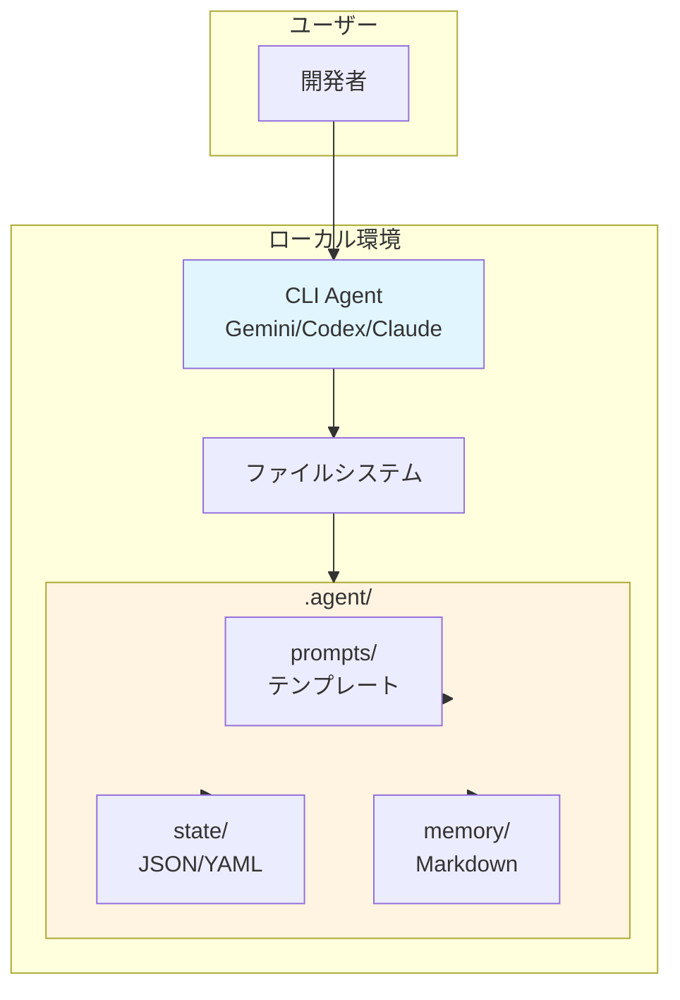
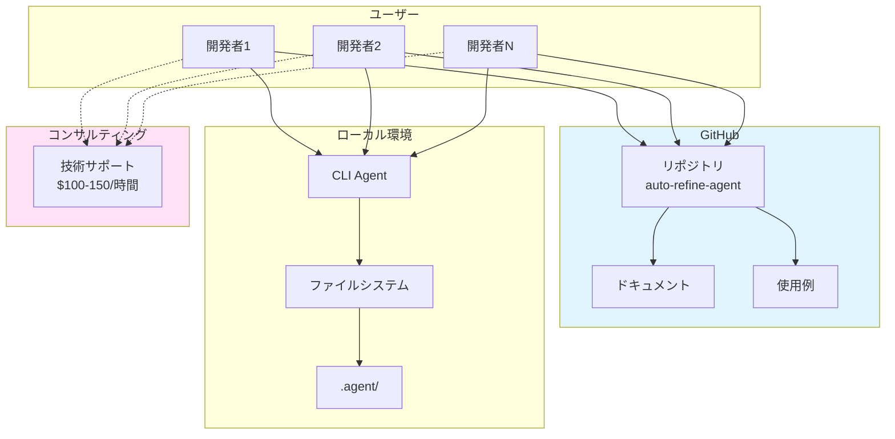
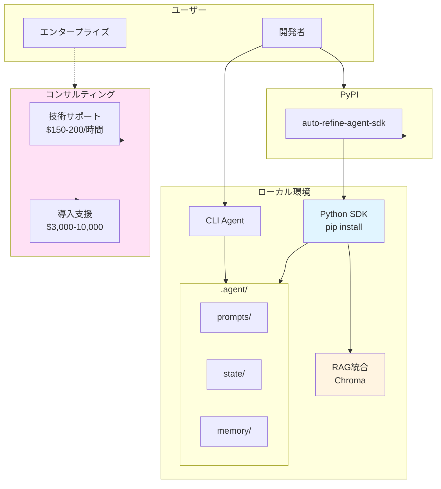
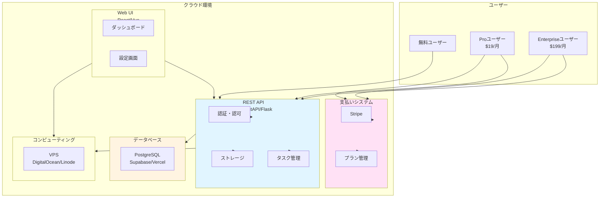
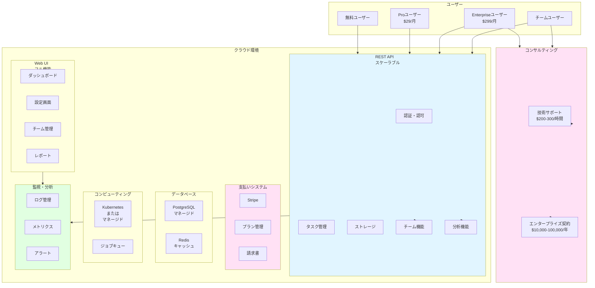

# 一人法人向けフレームワーク化・マネタイズ戦略（改訂版）

## 1. 一人法人での制約と戦略

### 1.1 一人法人の制約

- **リソース**: 開発時間が限られる（週20-40時間程度）
- **予算**: 初期投資が少ない
- **スキル**: 一人で全工程を担当
- **リスク**: 失敗のリスクを最小化する必要がある

### 1.2 戦略の調整

**従来のアプローチ**: 3層構造（Layer 1 → 2 → 3）を順次実装
**一人法人向けアプローチ**: **MVP優先 → 早期収益化 → 段階的拡張**

---

## 2. 改訂版ロードマップ（一人法人向け）

### Phase 0: MVP（最小限の製品）- 1-2ヶ月

**目標**: 動作する最小限のプロトタイプを作成し、市場検証

**実装範囲**:
- CLIリポジトリ型のコア機能のみ
- 基本的なプロンプトテンプレート
- シンプルな状態管理

**収益化**: なし（市場検証フェーズ）

**投資**: 時間のみ（開発コスト0円）

---

### Phase 1: オープンソース公開 - 2-3ヶ月

**目標**: GitHub公開、コミュニティ構築、フィードバック収集

**実装範囲**:
- 完全なドキュメント
- 使用例とチュートリアル
- 基本的なDelta Updates

**収益化**: 
- コンサルティング: $100-150/時間（早期ユーザー向け）
- 見込み収益: $500-2,000/月

**投資**: 開発時間のみ

---

### Phase 2: Python SDK開発 - 2-3ヶ月

**目標**: RAG統合など高度な機能の追加

**実装範囲**:
- Python SDK（最小限の機能）
- RAG統合（Chromaのみ）
- セマンティック検索（基本機能）

**収益化**:
- コンサルティング: $150-200/時間
- 導入支援: $3,000-10,000/プロジェクト
- 見込み収益: $2,000-5,000/月

**投資**: 開発時間のみ

---

### Phase 3: SaaS MVP - 3-4ヶ月

**目標**: 最小限のSaaS機能を提供し、早期収益化

**実装範囲**:
- REST API（最小限）
- シンプルなWeb UI（ダッシュボード）
- 認証・認可（基本機能）
- 支払い統合（Stripe）

**収益化**:
- Pro: $19/月（個人向け）
- Enterprise: $199/月（チーム向け）
- 見込み収益: $1,000-10,000/月（ユーザー数に依存）

**投資**: 
- 開発時間: 3-4ヶ月
- インフラコスト: $50-200/月（VPS、ドメイン等）

---

### Phase 4: スケール - 6ヶ月以降

**目標**: 機能拡張、ユーザー拡大、収益拡大

**実装範囲**:
- 高度な機能追加
- チーム機能
- エンタープライズ機能

**収益化**:
- SaaS: $5,000-50,000/月
- コンサルティング: $200-300/時間
- エンタープライズ契約: $10,000-100,000/年

**投資**: 継続的な開発時間

---

## 3. 各ステップのシステム構成図

### Phase 0: MVP（最小限の製品）

**技術スタック**:
- CLI Agent: Gemini CLI / Codex CLI / Claude Code
- ファイル形式: JSON / YAML / Markdown
- 依存関係: なし

**特徴**:
- 完全ローカル実行
- 依存関係なし
- シンプルな構成

**収益**: $0/月（市場検証フェーズ）

---

### Phase 1: オープンソース公開

**技術スタック**:
- GitHub: リポジトリホスティング
- ドキュメント: Markdown
- コンサルティング: メール/Zoom

**特徴**:
- オープンソース公開
- コミュニティ構築
- コンサルティングで初期収益

**収益**: $500-2,000/月（コンサルティング）

---

### Phase 2: Python SDK開発

**技術スタック**:
- Python SDK: pip install可能
- RAG: Chroma（軽量）
- PyPI: パッケージ配布

**特徴**:
- Python SDKで高度な機能追加
- RAG統合による差別化
- コンサルティング + 導入支援で収益化

**収益**: $2,000-5,000/月（コンサルティング + 導入支援）

---

### Phase 3: SaaS MVP

**技術スタック**:
- バックエンド: FastAPI / Flask（Python）
- フロントエンド: React / Vue（軽量）
- データベース: PostgreSQL（Supabase/Vercel）
- 支払い: Stripe
- ホスティング: VPS（DigitalOcean/Linode）またはVercel

**特徴**:
- 最小限のSaaS機能
- クラウドホスティング
- 自動化された支払い処理

**収益**: $1,000-10,000/月（ユーザー数に依存）

**コスト**: $50-200/月（インフラ）

---

### Phase 4: スケール

**技術スタック**:
- バックエンド: FastAPI + Celery（非同期処理）
- フロントエンド: React / Vue（フル機能）
- データベース: PostgreSQL（マネージド）+ Redis
- インフラ: Kubernetes または マネージドサービス（Vercel/Railway）
- 監視: Sentry、Datadog等

**特徴**:
- スケーラブルなアーキテクチャ
- チーム機能
- エンタープライズ機能
- 高度な監視・分析

**収益**: $5,000-50,000/月（ユーザー数に依存）

**コスト**: $200-1,000/月（インフラ）

---

## 4. 一人法人向け実装戦略

### 4.1 時間配分の目安

| Phase | 期間 | 週間時間 | 総時間 | 優先度 |
|-------|------|---------|--------|--------|
| **Phase 0** | 1-2ヶ月 | 20-30時間/週 | 160-240時間 | ⭐⭐⭐⭐⭐ |
| **Phase 1** | 2-3ヶ月 | 15-20時間/週 | 240-360時間 | ⭐⭐⭐⭐ |
| **Phase 2** | 2-3ヶ月 | 15-20時間/週 | 240-360時間 | ⭐⭐⭐ |
| **Phase 3** | 3-4ヶ月 | 20-30時間/週 | 480-720時間 | ⭐⭐⭐⭐ |
| **Phase 4** | 継続 | 10-20時間/週 | 継続 | ⭐⭐⭐ |

### 4.2 優先順位の考え方

**Phase 0-1**: MVPとオープンソース公開を最優先
- 市場検証が可能
- コミュニティ構築
- 早期フィードバック

**Phase 2**: Python SDKは**必要に応じて**（リソースが確保できた場合）
- オープンソースのフィードバックに基づいて判断

**Phase 3**: SaaS MVPは**収益化が見込める場合**に実装
- Phase 1-2で十分なニーズが確認できた場合

**Phase 4**: 継続的な改善と拡張

---

## 5. 収益化戦略（一人法人向け）

### 5.1 収益化のタイミング

#### Phase 1: 早期収益化（コンサルティング）

**開始時期**: Phase 1開始時（オープンソース公開後）

**収益源**:
- 技術サポート: $100-150/時間
- 導入支援: $500-2,000/プロジェクト

**見込み**:
- 月間5-10時間 × $100 = $500-1,000/月
- 四半期に1件の導入支援 = $500-2,000

**合計**: $500-2,000/月

#### Phase 2: 拡大収益化（コンサルティング + 導入支援）

**開始時期**: Phase 2開始時

**収益源**:
- 技術サポート: $150-200/時間
- 導入支援: $3,000-10,000/プロジェクト
- カスタマイズ: $5,000-20,000/プロジェクト

**見込み**:
- 月間10-20時間 × $150 = $1,500-3,000/月
- 四半期に1件の導入支援 = $3,000-10,000

**合計**: $2,000-5,000/月

#### Phase 3: SaaS収益化

**開始時期**: Phase 3開始時

**収益源**:
- SaaS サブスクリプション: $19-199/月
- コンサルティング: $200-300/時間

**見込み**:
- 50ユーザー × 20%転換率 × $19 = $190/月（初期）
- 100ユーザー × 10%転換率 × $29 = $290/月（成長）
- 10エンタープライズ × $199 = $1,990/月

**合計**: $1,000-10,000/月（ユーザー数に依存）

#### Phase 4: スケール収益化

**開始時期**: Phase 4開始時

**収益源**:
- SaaS サブスクリプション: $29-299/月
- エンタープライズ契約: $10,000-100,000/年
- コンサルティング: $200-300/時間

**見込み**:
- 500ユーザー × 15%転換率 × $29 = $2,175/月
- 50エンタープライズ × $299 = $14,950/月
- エンタープライズ契約: $10,000-100,000/年

**合計**: $5,000-50,000/月

---

## 6. 技術的な実装方針（一人法人向け）

### 6.1 MVP（Phase 0）の実装

**最小限の機能**:
- プロンプトテンプレートシステム（3-5テンプレート）
- 基本的な状態管理（JSON/YAML）
- シンプルなDelta Updates

**実装時間**: 1-2ヶ月（週20-30時間）

**技術スタック**:
- CLI Agent: Gemini CLI（無料）
- ファイル形式: JSON / YAML
- 依存関係: なし

### 6.2 オープンソース公開（Phase 1）の実装

**追加機能**:
- 完全なドキュメント
- 使用例とチュートリアル
- GitHub Actions（CI/CD）

**実装時間**: 2-3ヶ月（週15-20時間）

**技術スタック**:
- GitHub: リポジトリホスティング
- GitHub Actions: 自動化
- ドキュメント: Markdown + GitHub Pages

### 6.3 Python SDK（Phase 2）の実装

**最小限の機能**:
- RAG統合（Chromaのみ）
- セマンティック検索（基本機能）

**実装時間**: 2-3ヶ月（週15-20時間）

**技術スタック**:
- Python: 3.10+
- RAG: Chroma（軽量）
- PyPI: パッケージ配布

### 6.4 SaaS MVP（Phase 3）の実装

**最小限の機能**:
- REST API（基本エンドポイント）
- シンプルなWeb UI（ダッシュボード）
- 認証・認可（基本機能）
- 支払い統合（Stripe）

**実装時間**: 3-4ヶ月（週20-30時間）

**技術スタック**:
- バックエンド: FastAPI（軽量・高速）
- フロントエンド: React / Vue（軽量）
- データベース: PostgreSQL（Supabase/Vercel）
- 支払い: Stripe
- ホスティング: VPS（DigitalOcean）またはVercel

---

## 7. リスク管理（一人法人向け）

### 7.1 技術的リスク

**リスク**: 技術的負債の蓄積

**対策**:
- MVPから段階的に拡張
- コードレビュー（自分自身で）
- ドキュメントを充実

### 7.2 ビジネスリスク

**リスク**: 収益化の失敗

**対策**:
- Phase 1-2でコンサルティングで収益化
- Phase 3でSaaS収益化
- 複数の収益源を確保

### 7.3 リソースリスク

**リスク**: 開発時間の不足

**対策**:
- MVP優先で実装
- 必要に応じてPhase 2をスキップ
- Phase 3は収益が見込める場合のみ実装

---

## 8. 成功指標（KPI）

### Phase 0-1: 市場検証

- GitHub Stars: 100+
- ドキュメント閲覧数: 1,000+
- フィードバック: 10件以上

### Phase 2: 拡大

- PyPIダウンロード: 1,000+
- コンサルティング: 月間10時間以上
- 導入支援: 四半期に1件以上

### Phase 3: SaaS収益化

- 登録ユーザー: 100+
- 有料転換率: 10%+
- MRR: $1,000+

### Phase 4: スケール

- 登録ユーザー: 1,000+
- 有料転換率: 15%+
- MRR: $10,000+

---

## 9. 結論と推奨（一人法人向け）

### 9.1 推奨アプローチ

**段階的な実装**を推奨：

1. **Phase 0-1**: MVPとオープンソース公開を最優先
   - 市場検証
   - コミュニティ構築
   - 早期収益化（コンサルティング）

2. **Phase 2**: Python SDKは**必要に応じて**
   - オープンソースのフィードバックに基づいて判断
   - リソースが確保できた場合のみ実装

3. **Phase 3**: SaaS MVPは**収益化が見込める場合**に実装
   - Phase 1-2で十分なニーズが確認できた場合
   - インフラコストを考慮

4. **Phase 4**: 継続的な改善と拡張

### 9.2 マネタイズ可能性

✅ **高い**

**理由**:
- 段階的な収益化が可能
- 複数の収益源（コンサルティング、SaaS）
- リスクを最小化した戦略

**収益見込み**:
- Phase 1: $500-2,000/月（コンサルティング）
- Phase 2: $2,000-5,000/月（コンサルティング + 導入支援）
- Phase 3: $1,000-10,000/月（SaaS）
- Phase 4: $5,000-50,000/月（スケール）

### 9.3 次のステップ

1. **Phase 0開始**: MVP開発（1-2ヶ月）
2. **市場検証**: 初期ユーザーからフィードバック収集
3. **Phase 1開始**: オープンソース公開（2-3ヶ月）
4. **収益化開始**: コンサルティングで早期収益化
5. **判断**: Phase 2-3の実装を判断（フィードバックに基づく）

---

**作成日**: 2025-01-XX  
**最終更新**: 2025-01-XX  
**ステータス**: 一人法人向け戦略確定

