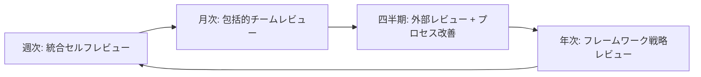

# 強化レビュープロセスフレームワーク - 包括的品質保証システム
# Enhanced Review Process Framework - Comprehensive Quality Assurance System

## KEYWORDS: review-process, quality-assurance, feedback-reflection, critical-analysis, process-control, ai-coordination
## DOMAIN: quality-assurance|process-improvement|ai-coordination|continuous-improvement
## PRIORITY: MANDATORY
## WHEN: すべてのプロジェクトレビュー実行時、品質ゲート通過判定、統合作業前の必須確認
## NAVIGATION: CLAUDE.md → quality gates → enhanced review process → this file
## RELATED: memory-bank/11-checklist-driven/verification_evaluation_mechanisms.md - CDTE verification systems

## RULE: すべてのレビューは体系的な批判的分析と100%のフィードバック反映により実施されなければならない

---

# 🎥 フレームワーク概要

本フレームワークは、批判的レビューの実施から必須フィードバック反映まで、完全なレビューライフサイクルを管理します。

## 🗺️ ナビゲーションマップ

```yaml
フレームワーク構成:
  Part_I_批判的レビュー篇:
    - 多角的評価マトリクス
    - 段階的レビュープロセス
    - メトリクスベース評価
    
  Part_II_フィードバック反映篇:
    - 必須反映プロトコル
    - Review→Integration→Confirmationループ
    - AI間フィードバック確認
    
  Part_III_統合実装篇:
    - 自動化システム
    - 継続的改善プロセス
    - 品質文化の確立
```

---

# PART I: 批判的レビュー篇 - 体系的品質評価

## 📊 レビュー観点マトリクス

### 1. 技術的観点

| 観点 | 評価項目 | 重要度 | A2A MVP評価 | 改善提案 |
|------|----------|--------|-------------|----------|
| **再現性** | ゼロから同じ品質を再現可能か | ★★★★★ | ✅ 良好 | チェックリスト自動化 |
| **汎用性** | 他プロジェクトへの転用可能性 | ★★★★★ | ⚠️ 要改善 | 汎用パターン抽出必要 |
| **保守性** | 6ヶ月後の他者による修正容易性 | ★★★★☆ | ✅ 良好 | より詳細なコメント |
| **拡張性** | 新機能追加の容易性 | ★★★★☆ | ✅ 良好 | プラグイン機構検討 |
| **性能** | 実用的なレスポンス時間 | ★★★☆☆ | ✅ 良好 | ベンチマーク追加 |
| **セキュリティ** | 脆弱性対策の網羅性 | ★★★★★ | ⚠️ 基本のみ | セキュリティテスト追加 |

### 2. プロセス観点

| 観点 | 評価項目 | 重要度 | A2A MVP評価 | 改善提案 |
|------|----------|--------|-------------|----------|
| **学習曲線** | 新規参画者の立ち上がり時間 | ★★★★☆ | ⚠️ 要改善 | チュートリアル作成 |
| **自動化度** | 手動作業の最小化 | ★★★★★ | ✅ 良好 | デプロイ自動化追加 |
| **文書化** | 意図と実装の一致度 | ★★★★☆ | ✅ 良好 | 動画解説追加 |
| **標準準拠** | 業界標準への適合度 | ★★★☆☆ | ✅ 良好 | OpenAPI仕様追加 |

### 3. ビジネス観点

| 観点 | 評価項目 | 重要度 | A2A MVP評価 | 改善提案 |
|------|----------|--------|-------------|----------|
| **ROI** | 投資対効果 | ★★★★★ | ✅ 3日で91.77% | 計測自動化 |
| **リスク** | 技術的負債の蓄積度 | ★★★★☆ | ✅ 低い | 定期的な負債計測 |
| **スケール** | 成長への対応力 | ★★★☆☆ | ⚠️ 未検証 | 負荷テスト実施 |

## 🔍 段階的レビュー実施プロセス

### Phase 1: 自己評価（開発者）

```yaml
self_review_checklist:
  code_quality:
    - [ ] すべてのpublicメソッドにdocstringがあるか
    - [ ] 複雑なロジックに説明コメントがあるか
    - [ ] 命名は自明で一貫性があるか
    
  test_quality:
    - [ ] テストは仕様を表現しているか
    - [ ] エッジケースがカバーされているか
    - [ ] テストは高速で独立しているか
    
  architecture:
    - [ ] 依存関係は単方向か
    - [ ] 各層の責任は明確か
    - [ ] 循環依存は存在しないか
```

### Phase 2: ピアレビュー（チームメンバー）

```yaml
peer_review_checklist:
  understandability:
    - [ ] READMEだけで環境構築できるか
    - [ ] コードの意図が明確か
    - [ ] エラーメッセージは親切か
    
  maintainability:
    - [ ] 変更の影響範囲が予測可能か
    - [ ] テストの修正が容易か
    - [ ] 設定の変更が容易か
```

### Phase 3: 外部レビュー（第三者）

```yaml
external_review_checklist:
  first_impression:
    - [ ] プロジェクトの目的が30秒で理解できるか
    - [ ] 始め方が明確か
    - [ ] 期待される成果が明確か
    
  deep_dive:
    - [ ] アーキテクチャの選択理由が妥当か
    - [ ] 技術選定の根拠が明確か
    - [ ] 制約事項が文書化されているか
```

## 📊 メトリクスベースの評価

### 定量的指標計算システム

```python
class ProjectMetrics:
    def calculate_health_score(self):
        """プロジェクトの健全性スコア（0-100）"""
        scores = {
            'coverage': self.get_coverage_score(),      # 0-25
            'complexity': self.get_complexity_score(),   # 0-25
            'documentation': self.get_doc_score(),       # 0-25
            'dependencies': self.get_dep_score(),        # 0-25
        }
        return sum(scores.values())
    
    def get_coverage_score(self):
        coverage = self.test_coverage
        if coverage >= 90: return 25
        if coverage >= 80: return 20
        if coverage >= 70: return 15
        if coverage >= 60: return 10
        return 5
    
    def get_complexity_score(self):
        avg_complexity = self.average_cyclomatic_complexity
        if avg_complexity <= 5: return 25
        if avg_complexity <= 10: return 20
        if avg_complexity <= 15: return 15
        if avg_complexity <= 20: return 10
        return 5
```

---

# PART II: フィードバック反映篇 - 必須実装保証

## 🚨 レビュー結果必須反映プロトコル

### RULE 1: フィードバック反映検証システム

#### Trigger
- レビューチームから指摘事項・改善提案が出された時
- 統合作業を開始する前
- 品質ゲート通過判定を行う前

#### 強制検証プロセス
```bash
# レビュー指摘事項完全チェックシステム
review_feedback_checklist() {
    echo "🔍 Review Feedback Mandatory Check"
    
    # 1. 指摘事項の完全リスト化
    list_review_feedback() {
        echo "📋 Listing all review feedback..."
        find logs/review/ -name "*.feedback" -exec cat {} \; | \
        grep -E "ISSUE:|SUGGESTION:|REQUIREMENT:" | sort | uniq
    }
    
    # 2. 対応状況の網羅的確認
    check_feedback_status() {
        local feedback_item="$1"
        # 統合作業での対応有無を確認
        grep -r "$feedback_item" docs/ src/ || echo "❌ NOT REFLECTED: $feedback_item"
    }
    
    # 3. 未対応項目の完全検出
    detect_unreflected_items() {
        list_review_feedback | while read feedback; do
            check_feedback_status "$feedback"
        done | grep "❌ NOT REFLECTED" && return 1 || return 0
    }
    
    # 実行
    if ! detect_unreflected_items; then
        echo "🚨 CRITICAL: Unreflected review feedback detected!"
        echo "⛔ Integration MUST NOT proceed until all feedback is reflected"
        return 1
    fi
    
    echo "✅ All review feedback reflected"
    return 0
}
```

### RULE 2: Review→Integration→Confirmationループ

#### 必須実行フロー
```yaml
Review-Integration-Confirmation-Loop:
  1_Review_Phase:
    - Review Team実行
    - 指摘事項文書化
    - 改善提案明文化
    
  2_Integration_Phase:
    - 指摘事項確認（必須）
    - 改善実装（必須）
    - 実装記録（必須）
    
  3_Confirmation_Phase:
    - Review Team確認（必須）
    - 反映完了承認（必須）
    - 品質ゲート通過（必須）
```

#### R-I-Cループ実行管理
```bash
# R-I-Cループ完全実行システム
execute_ric_loop() {
    local project_id="$1"
    
    # Phase 1: Review（批判的レビュー実行）
    echo "📝 Phase 1: Review Phase"
    review_results=$(execute_comprehensive_review "$project_id")
    save_review_results "$project_id" "$review_results"
    
    # Phase 2: Integration（必須反映実装）
    echo "🔧 Phase 2: Integration Phase"
    load_review_feedback "$project_id"
    implement_feedback_changes "$project_id"
    record_implementation_log "$project_id"
    
    # Phase 3: Confirmation（反映確認）
    echo "✅ Phase 3: Confirmation Phase"
    if ! confirm_feedback_reflection "$project_id"; then
        echo "❌ Feedback reflection incomplete - returning to Phase 2"
        return 1
    fi
    
    echo "✅ R-I-C Loop completed successfully"
    return 0
}
```

### RULE 3: AI間フィードバック確認プロトコル

#### tmux環境での確実なフィードバック伝達
```bash
# AI間フィードバック確認システム
ai_feedback_confirmation() {
    local sender_pane="$1"
    local receiver_pane="$2"
    local feedback_content="$3"
    
    # Step 1: フィードバック送信
    tmux send-keys -t "$receiver_pane" "FEEDBACK: $feedback_content"
    tmux send-keys -t "$receiver_pane" Enter
    
    # Step 2: 受信確認要求
    tmux send-keys -t "$receiver_pane" "CONFIRM RECEIPT: Reply with 'FEEDBACK RECEIVED'"
    tmux send-keys -t "$receiver_pane" Enter
    
    # Step 3: 確認待機（最大60秒）
    local timeout=60
    local confirmed=false
    
    while [ $timeout -gt 0 ]; do
        if tmux capture-pane -t "$receiver_pane" -p | grep -q "FEEDBACK RECEIVED"; then
            confirmed=true
            break
        fi
        sleep 1
        ((timeout--))
    done
    
    # Step 4: 結果処理
    if [ "$confirmed" = true ]; then
        echo "✅ Feedback confirmed by $receiver_pane"
        log_feedback_confirmation "$sender_pane" "$receiver_pane" "$feedback_content"
        return 0
    else
        echo "❌ Feedback NOT confirmed by $receiver_pane"
        escalate_feedback_failure "$sender_pane" "$receiver_pane" "$feedback_content"
        return 1
    fi
}
```

---

# PART III: 統合実装篇 - 自動化と継続改善

## 🔧 統合レビュープロセス実行システム

### 包括的レビュー実行関数
```bash
# 統合レビュープロセス実行
execute_comprehensive_review() {
    local project_id="$1"
    
    echo "🚀 Starting Comprehensive Review Process for $project_id"
    
    # Step 1: 批判的レビュー実行
    echo "📊 Phase 1: Critical Review Execution"
    execute_critical_review_matrix "$project_id"
    
    # Step 2: メトリクス評価
    echo "📈 Phase 2: Metrics-Based Evaluation"
    calculate_project_health_score "$project_id"
    
    # Step 3: 段階的レビュー
    echo "🔍 Phase 3: Multi-Phase Review"
    execute_self_review "$project_id"
    execute_peer_review "$project_id"
    execute_external_review "$project_id"
    
    # Step 4: フィードバック収集・検証
    echo "📝 Phase 4: Feedback Collection & Verification"
    collect_all_feedback "$project_id"
    verify_feedback_completeness "$project_id"
    
    # Step 5: R-I-Cループ開始
    echo "🔄 Phase 5: R-I-C Loop Execution"
    execute_ric_loop "$project_id"
    
    echo "✅ Comprehensive Review Process completed"
}
```

## 📋 レビュー完了ゲートシステム

### 必須ゲート条件
```yaml
Review_Completion_Gates:
  Gate_1_Critical_Review_Completion:
    - 技術・プロセス・ビジネス観点の評価完了
    - 定量的メトリクス測定完了
    - 段階的レビュー（自己・ピア・外部）完了
    
  Gate_2_Feedback_Documentation:
    - すべての指摘事項が文書化されている
    - 各指摘事項に優先度が設定されている
    - 対応方針が明確になっている
    
  Gate_3_Implementation_Verification:
    - すべての高優先度項目が対応完了
    - 中優先度項目の80%以上が対応完了
    - 対応できない項目の理由が文書化
    
  Gate_4_Review_Team_Approval:
    - Review Teamによる実装確認完了
    - 品質基準を満たしていることの承認
    - 次フェーズ移行の明示的承認
```

### ゲート通過検証システム
```bash
# 包括的ゲート検証
verify_review_gates() {
    local project_id="$1"
    local all_gates_passed=true
    
    echo "🚪 Verifying Review Gates for $project_id"
    
    # Gate 1: Critical Review Completion
    if ! verify_critical_review_completion "$project_id"; then
        echo "❌ Gate 1 FAILED: Critical Review incomplete"
        all_gates_passed=false
    else
        echo "✅ Gate 1 PASSED: Critical Review completed"
    fi
    
    # Gate 2: Feedback Documentation
    if ! verify_feedback_documentation "$project_id"; then
        echo "❌ Gate 2 FAILED: Feedback documentation incomplete"
        all_gates_passed=false
    else
        echo "✅ Gate 2 PASSED: Feedback documented"
    fi
    
    # Gate 3: Implementation Verification
    if ! verify_implementation_completion "$project_id"; then
        echo "❌ Gate 3 FAILED: Implementation verification failed"
        all_gates_passed=false
    else
        echo "✅ Gate 3 PASSED: Implementation verified"
    fi
    
    # Gate 4: Review Team Approval
    if ! verify_review_team_approval "$project_id"; then
        echo "❌ Gate 4 FAILED: Review team approval missing"
        all_gates_passed=false
    else
        echo "✅ Gate 4 PASSED: Review team approved"
    fi
    
    if [ "$all_gates_passed" = true ]; then
        echo "🎉 ALL GATES PASSED: Review process completed successfully"
        return 0
    else
        echo "🚨 GATE FAILURES DETECTED: Cannot proceed to next phase"
        return 1
    fi
}
```

## 📝 統合レビュー文書化テンプレート

```markdown
# [プロジェクト名] Enhanced Review Report

## Executive Summary
- **日付**: YYYY-MM-DD
- **レビュアー**: [名前/役割]
- **レビュー段階**: [Self/Peer/External/Comprehensive]
- **総合評価**: [S/A/B/C/D]
- **R-I-Cループ状態**: [Completed/In Progress/Pending]

## Critical Review Results

### 技術的観点評価
| 観点 | スコア | コメント | 改善アクション |
|------|--------|----------|----------------|
| 再現性 | X/5 | [評価詳細] | [具体的改善策] |
| 汎用性 | X/5 | [評価詳細] | [具体的改善策] |

### プロセス観点評価
| 観点 | スコア | コメント | 改善アクション |
|------|--------|----------|----------------|
| 学習曲線 | X/5 | [評価詳細] | [具体的改善策] |
| 自動化度 | X/5 | [評価詳細] | [具体的改善策] |

### ビジネス観点評価
| 観点 | スコア | コメント | 改善アクション |
|------|--------|----------|----------------|
| ROI | X/5 | [評価詳細] | [具体的改善策] |
| リスク | X/5 | [評価詳細] | [具体的改善策] |

## Feedback Reflection Status

### 高優先度フィードバック
- [ ] ✅ REFLECTED / ❌ PENDING - [フィードバック項目1]
- [ ] ✅ REFLECTED / ❌ PENDING - [フィードバック項目2]

### 中優先度フィードバック
- [ ] ✅ REFLECTED / ❌ PENDING - [フィードバック項目1]
- [ ] ✅ REFLECTED / ❌ PENDING - [フィードバック項目2]

### 低優先度フィードバック
- [ ] ✅ REFLECTED / ❌ PENDING - [フィードバック項目1]

## Metrics & Measurements

### Project Health Score
- **Overall Score**: X/100
- **Coverage Score**: X/25
- **Complexity Score**: X/25
- **Documentation Score**: X/25
- **Dependencies Score**: X/25

### Review Process Metrics
- **Feedback Reflection Rate**: X%
- **Confirmation Success Rate**: X%
- **R-I-C Loop Completion Time**: X hours

## R-I-C Loop Execution Log

### Review Phase
- **Start Time**: YYYY-MM-DD HH:MM
- **Reviewers**: [リスト]
- **Completion Time**: YYYY-MM-DD HH:MM

### Integration Phase
- **Start Time**: YYYY-MM-DD HH:MM
- **Integration Actions**: [実装したアクション]
- **Completion Time**: YYYY-MM-DD HH:MM

### Confirmation Phase
- **Start Time**: YYYY-MM-DD HH:MM
- **Confirmation Result**: [PASSED/FAILED]
- **Completion Time**: YYYY-MM-DD HH:MM

## Strengths（強み）
1. [具体的な強み1]
2. [具体的な強み2]

## Areas for Improvement（改善領域）
1. [具体的な改善点1] - Priority: [High/Medium/Low]
2. [具体的な改善点2] - Priority: [High/Medium/Low]

## Action Items
| 優先度 | 項目 | 担当 | 期限 | 反映状況 |
|--------|------|------|------|----------|
| High | [アクション1] | [担当者] | [期限] | [REFLECTED/PENDING] |
| Medium | [アクション2] | [担当者] | [期限] | [REFLECTED/PENDING] |

## Gate Status
- [ ] ✅ PASSED / ❌ FAILED - Gate 1: Critical Review Completion
- [ ] ✅ PASSED / ❌ FAILED - Gate 2: Feedback Documentation
- [ ] ✅ PASSED / ❌ FAILED - Gate 3: Implementation Verification
- [ ] ✅ PASSED / ❌ FAILED - Gate 4: Review Team Approval

## Next Steps
1. [次のステップ1]
2. [次のステップ2]

---
*Review Framework: Enhanced Review Process Framework*
*Generation Date: $(date)*
*R-I-C Loop Status: [Completed/In Progress]*
```

## 🚨 よくある失敗パターンと対策

### アンチパターン1: 「レビュー結果の暗黙的無視」
```bash
# ❌ 悪い例
execute_integration() {
    # レビュー結果を確認せずに統合作業を開始
    merge_worker_outputs
    create_final_document
}

# ✅ 正しい例
execute_integration() {
    # レビュー結果の必須確認
    if ! review_feedback_checklist; then
        echo "⛔ Cannot proceed - review feedback not reflected"
        return 1
    fi
    
    # 批判的レビューゲートの確認
    if ! verify_review_gates "$project_id"; then
        echo "⛔ Cannot proceed - review gates not passed"
        return 1
    fi
    
    merge_worker_outputs
    create_final_document
}
```

### アンチパターン2: 「表面的レビューでの完了判定」
```bash
# ❌ 悪い例
conduct_review() {
    # 単一観点での表面的レビュー
    check_basic_functionality && echo "Review Complete"
}

# ✅ 正しい例
conduct_review() {
    # 多角的・段階的レビュー
    execute_critical_review_matrix "$project_id"
    execute_multi_phase_review "$project_id"
    verify_feedback_reflection "$project_id"
    
    if verify_review_gates "$project_id"; then
        echo "✅ Comprehensive Review Complete"
    else
        echo "❌ Review Requirements Not Met"
        return 1
    fi
}
```

## 📊 包括的測定指標

### 統合測定システム
```yaml
Enhanced_Review_Metrics:
  # 批判的レビュー指標
  critical_review_completeness:
    formula: (completed_review_aspects / total_review_aspects) * 100
    target: 100%
    alert_threshold: <100%
    
  review_quality_score:
    formula: avg(technical_score, process_score, business_score)
    target: >80/100
    alert_threshold: <70/100
    
  # フィードバック反映指標
  feedback_reflection_rate:
    formula: (reflected_items / total_feedback_items) * 100
    target: 100%
    alert_threshold: <100%
    
  confirmation_success_rate:
    formula: (confirmed_feedbacks / total_feedbacks) * 100
    target: 100%
    alert_threshold: <95%
    
  # プロセス効率指標
  ric_loop_completion_time:
    formula: confirmation_time - review_start_time
    target: <2 hours
    alert_threshold: >4 hours
    
  gate_pass_rate:
    formula: (passed_gates / total_gates) * 100
    target: 100%
    alert_threshold: <100%
```

## 🔄 継続的改善プロセス

### 定期レビューサイクル


### 改善の優先順位付けシステム
```python
def prioritize_review_improvements(issues):
    """レビュー改善項目の優先順位付け"""
    for issue in issues:
        # 統合スコア計算
        issue.score = (
            issue.impact * 3 +              # 影響度（1-5）× 3
            issue.effort_inverse * 2 +       # 労力の逆数（1-5）× 2
            issue.risk * 1 +                 # リスク（1-5）× 1
            issue.feedback_reflection * 2    # フィードバック反映重要度（1-5）× 2
        ) / 8
    
    return sorted(issues, key=lambda x: x.score, reverse=True)
```

## 🚨 自動化・監視システム

### 統合自動チェックシステム
```bash
#!/bin/bash
# enhanced-review-automation.sh

echo "🔍 Running Enhanced Review Automation..."

# 1. Critical Review Matrix Check
echo "📊 Checking critical review matrix..."
check_technical_aspects
check_process_aspects  
check_business_aspects

# 2. Feedback Reflection Verification
echo "🔄 Verifying feedback reflection..."
review_feedback_checklist

# 3. R-I-C Loop Status Check
echo "🔄 Checking R-I-C loop status..."
verify_ric_loop_completion

# 4. Gate Status Verification
echo "🚪 Verifying review gates..."
verify_review_gates "$PROJECT_ID"

# 5. Metrics Collection
echo "📈 Collecting review metrics..."
collect_review_metrics

# 6. Automated Quality Checks
echo "🔧 Running automated quality checks..."
flake8 --statistics src/
mypy src/
pytest --cov=src --cov-report=term-missing

# 7. Documentation Quality
echo "📚 Checking documentation quality..."
pydocstyle src/
sphinx-build -b linkcheck docs/ _build/

# 8. Security & Dependencies
echo "🔐 Security and dependency checks..."
bandit -r src/
safety check
pip-audit

# Generate comprehensive report
python generate_enhanced_review_report.py
```

### 違反検出・自動停止システム
```bash
# 統合違反検出・自動停止システム
enforce_enhanced_review_process() {
    # リアルタイム監視
    while true; do
        if integration_in_progress; then
            # 批判的レビュー完了確認
            if ! critical_review_completed; then
                echo "🚨 VIOLATION: Integration without critical review"
                halt_integration_process
                send_critical_alert "Critical review not completed"
                break
            fi
            
            # フィードバック反映確認
            if ! all_feedback_reflected; then
                echo "🚨 VIOLATION: Integration without feedback reflection"
                halt_integration_process
                send_critical_alert "Review feedback not reflected"
                break
            fi
            
            # ゲート通過確認
            if ! all_review_gates_passed; then
                echo "🚨 VIOLATION: Integration without gate approval"
                halt_integration_process
                send_critical_alert "Review gates not passed"
                break
            fi
        fi
        sleep 5
    done
}
```

## 🎯 レビュー文化の確立

### 心理的安全性の確保
1. **建設的フィードバック文化**
   - ❌ 「このコードはひどい」
   - ✅ 「このコードは動作しますが、〇〇パターンを使うとより保守しやすくなります」

2. **学習機会としての活用**
   - レビューで学んだことを共有
   - ベストプラクティスの文書化
   - 失敗事例の共有（非難なし）

3. **定期的な振り返り**
   - レビュープロセス自体の改善
   - フィードバックの質の向上
   - 効率化の機会の発見

### 包括的レビュー文化の指標
```yaml
Review_Culture_Metrics:
  psychological_safety:
    - feedback_quality_score: ">8/10"
    - participation_rate: ">95%"
    - satisfaction_score: ">8/10"
    
  learning_effectiveness:
    - knowledge_sharing_frequency: "weekly"
    - best_practice_documentation: "monthly"
    - improvement_implementation_rate: ">80%"
    
  process_maturity:
    - automation_coverage: ">90%"
    - gate_compliance_rate: "100%"
    - continuous_improvement_cycle: "quarterly"
```

## RELATED

### 直接関連
- CLAUDE.md → Quality Gates → Enhanced Review Process Framework
- memory-bank/04-quality/quality_assurance_process_improvement.md
- memory-bank/02-organization/ai_agent_coordination_mandatory.md

### 実装関連
- memory-bank/02-organization/competitive_organization_framework.md
- memory-bank/09-meta/progress_recording_mandatory_rules.md
- memory-bank/09-meta/session_continuity_task_management.md

### 品質関連
- memory-bank/00-core/value_assessment_mandatory.md
- memory-bank/04-quality/enhanced_quality_assurance_standards.md

---

**重要**: このフレームワークは批判的レビューと必須フィードバック反映の完全統合により、包括的品質保証を実現する。表面的レビューや部分的反映は品質リスクを生み出すため、完全なプロセス遵守が必須である。

*Integrated Date: 2025-07-01*
*Sources: Integrated from critical review methodologies + mandatory feedback reflection protocols*
*Integration Type: Comprehensive Framework - Critical Review + Mandatory Reflection*