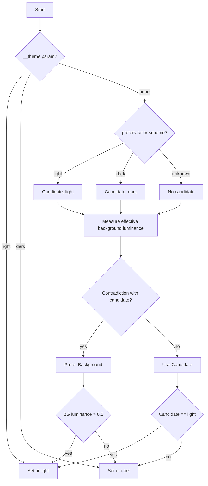
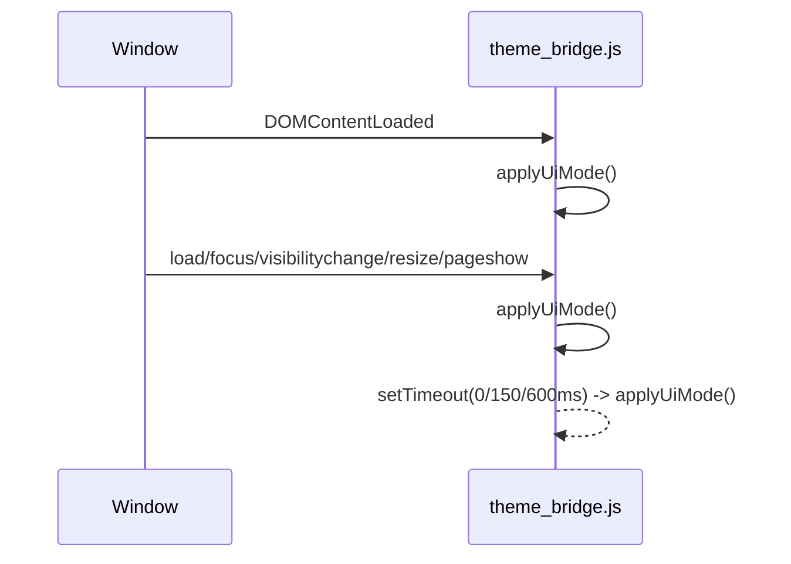

# Gradio System モード × Chrome テーマで文字色が薄くなる問題の再発防止策（2025-08-25）

## 概要
- **事象**: Chrome ライトモード + Gradio システムモードで、表示上はライトなのにスレッド名やスライダー周辺テキストが薄いグレーになり可読性が低下。
- **状況差**: 同じChromeでも別テーマでは System でも黒字で問題なし。Gradio を明示ライト/ダークにすると常に正常。
- **結論**: System（自動）モード時のテーマ判定ヒューリスティックが特定環境で誤判定し、ライト背景にダーク用の文字色が適用されていた。

## 環境
- ブラウザ: Google Chrome（OS/Chrome テーマ差あり）
- Gradio: Blocks UI（アプリは FastAPI で Gradio を `/gradio` にマウント）

## 症状
- スレッドタブのスレッド名（`.thread-title`）やスライダー周辺のラベル/値が、ライト背景上で薄いグレーに見えにくい。

## 原因分析（要点）
1) Systemモードで `__theme` が付与されないため、JSヒューリスティック判定が発動。
   - 透明背景（rgba(...,0)）を読み取るタイミングがあり、輝度0扱い→誤ってダークと判定。
   - `prefers-color-scheme` と実際の背景の見え方が矛盾する Chrome テーマ設定があり、CSS適用が食い違うケースが存在。
2) 一部環境で Shadow DOM（`gradio-app.shadowRoot`）配下に重要ラベルがあり、外部CSSの影響が届きづらいリスク。

## 対処（実装内容）
### 1. テーマ判定の堅牢化（`public/scripts/theme_bridge.js`）
- 判定優先度: `__theme`（明示） > `prefers-color-scheme` > 実背景の輝度 > 最終ライト。
- 透明背景回避: 祖先を遡って「非透明の背景色」を探索。見つからなければ白扱い。
- 矛盾時の決定: `prefers-color-scheme` と実背景が矛盾したら「実背景」を優先。
- 再適用イベント: `DOMContentLoaded`/`load`/`focus`/`visibilitychange`/`resize`/`pageshow` と遅延再評価（0/150/600ms）。
- Shadow DOM 保険: `gradio-app.shadowRoot` があれば、`.thread-title` とフォームラベル/スライダー関連の最小限の文字色スタイルを ShadowRoot 内に注入。

### Mermaid: テーマ判定フロー

### 2. ライト時の文字色をCSSで明示（`public/styles/app.css`）
- ライトモード時に、フォームラベル/スライダー周辺テキストの色を濃色へ強制上書き（可読性の底上げ）。

### Mermaid: 再適用イベントと安定化タイミング

## 検証結果
- Chrome テーマ × Gradio モード 全組合せで OK（黒字・十分なコントラスト）。
  - Chrome: ライト × Gradio: ライト → OK
  - Chrome: ライト × Gradio: ダーク → OK
  - Chrome: ライト × Gradio: システム → OK
  - Chrome: ダーク × Gradio: ライト → OK
  - Chrome: ダーク × Gradio: ダーク → OK
  - Chrome: ダーク × Gradio: システム → OK

## 追加の運用回避策（必要時）
- 初回遷移で `?__theme=light` を付与して明示ライトにする（環境依存の誤判定を確実回避）。

## DevTools チェック手順
- 現在の適用クラス: `document.documentElement.className`（`ui-light`/`ui-dark`）
- スレッド名の色: `getComputedStyle(document.querySelector('#threads_list_tab .thread-title')).color`
- CSS読込確認: `[...document.styleSheets].some(s => (s.href||'').includes('/public/styles/app.css'))`

## 教訓 / ベストプラクティス
1. `prefers-color-scheme` を鵜呑みにせず、実背景の見え方で最終判断。
2. 透明背景や初期描画タイミングに注意し、複数イベント/遅延再評価で安定化。
3. Shadow DOM 配下に最小限の保険スタイルを注入して外部CSSの届かないケースを補強。
4. クリティカルな可読性要素（タイトル/ラベル/スライダー値）はライト時に明示色で上書き。

## 参照
- JS: `public/scripts/theme_bridge.js`
- CSS: `public/styles/app.css`
- Gradio 組込み: `app/app_factory.py`（head への link/script 挿入）
